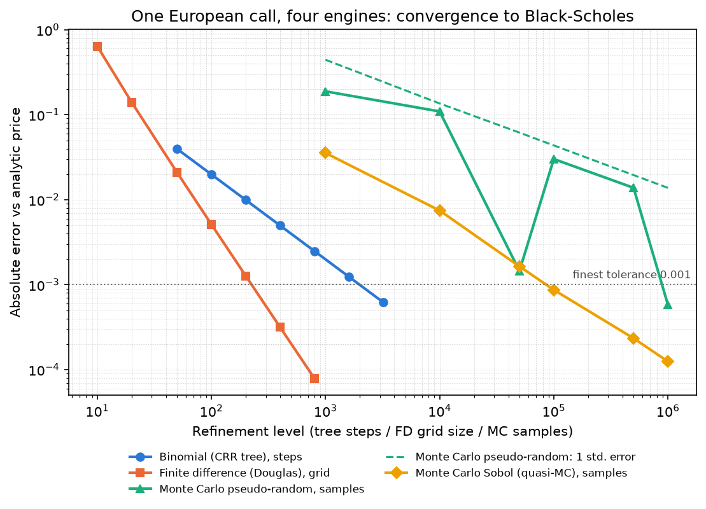
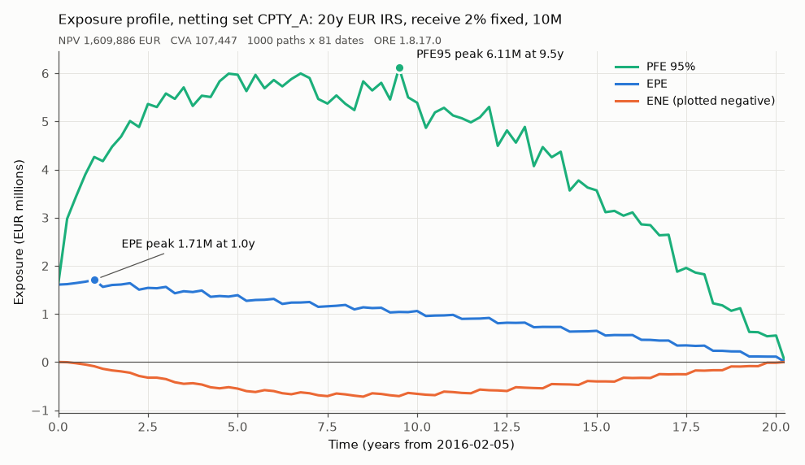
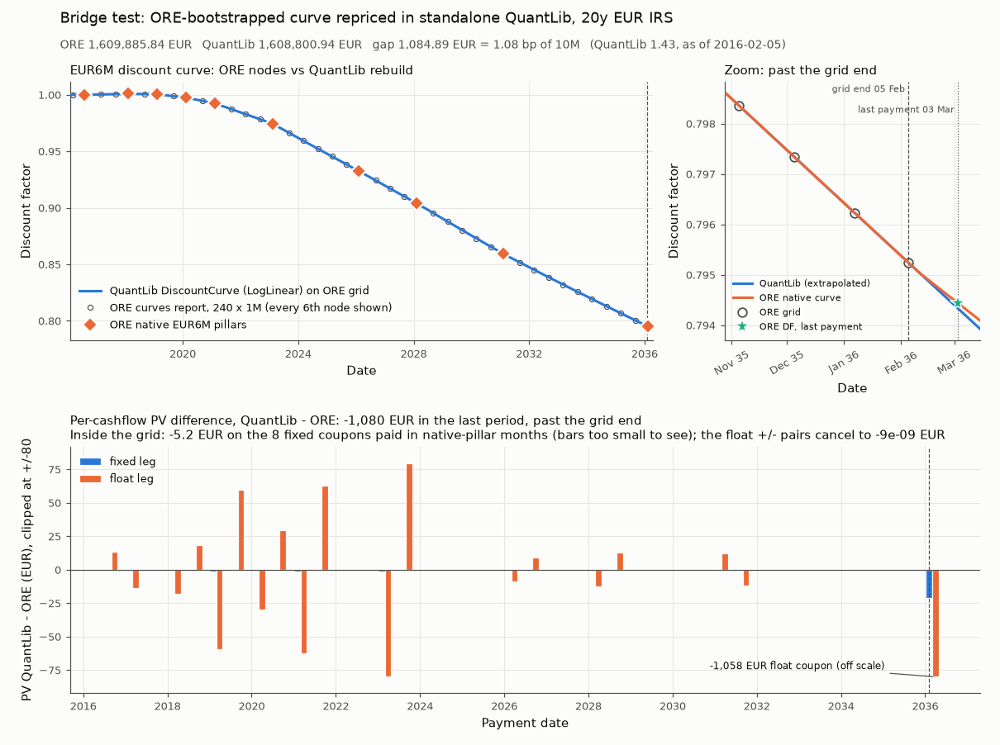
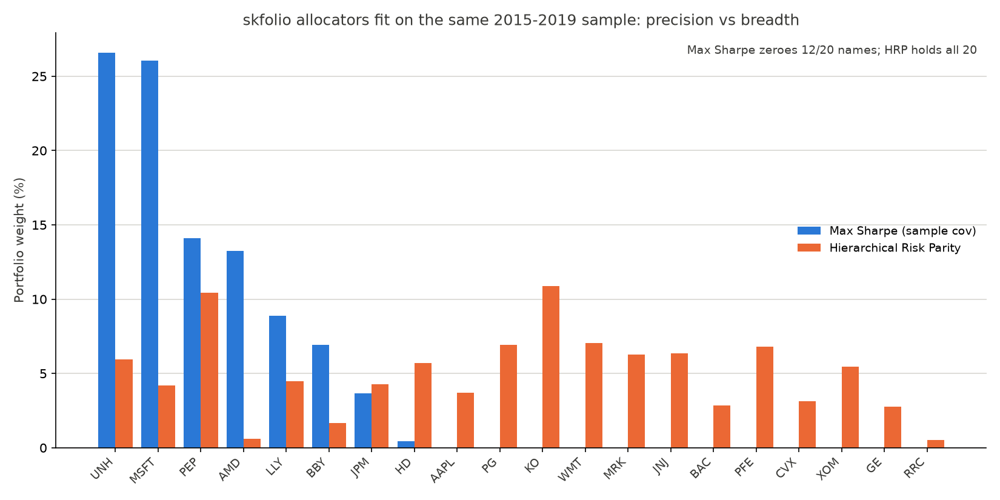
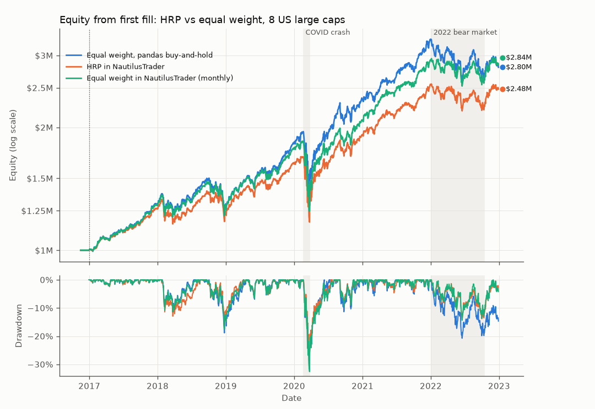
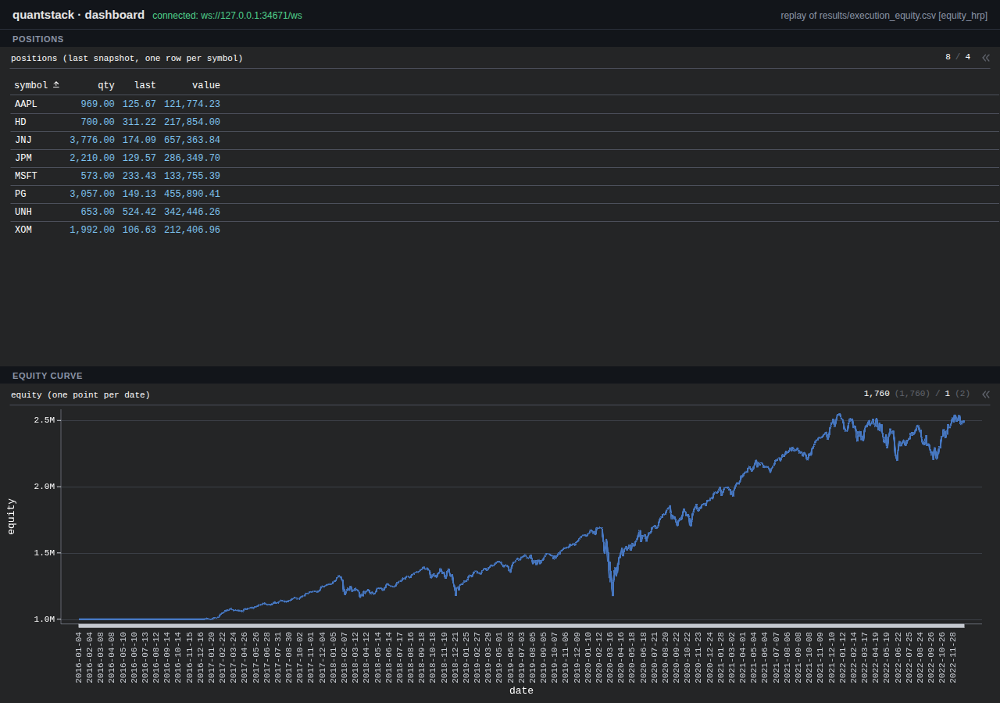

# quantstack: five quant repos, one process

Five open-source projects cover the five jobs of a systematic book.
QuantLib prices, ORE (Open Source Risk Engine) simulates exposure and XVA, skfolio sizes the portfolio, NautilusTrader executes it, and Perspective displays it.
None of them knows the others exist.
This repository is the drivetrain between them.
The four data contracts live in `quantstack/contracts.py` (201 lines of code, 374 with docstrings).
Each engine has its own stage module under `quantstack/`; the whole package is about 5,100 lines of code (8,333 lines in all).
The driver, `scripts/run_all.py` (563 lines of code, 789 in all), runs all five engines in one Python process, with the dashboard live during the backtest.
Lines of code here exclude blank, comment-only and docstring lines.
It reproduces the article "Five Repos, One Engine: Wiring the Open-Source Quant Stack" by Antonije Mirkovic ([quantframe.io](https://www.quantframe.io/article/five-repos-one-engine)) and records every place where the numbers differ, and why.

| Stage | Library | Module | Headline result (committed in `results/`) |
|---|---|---|---|
| Pricing | QuantLib 1.43 | `quantstack/pricing/four_engines.py` | one option object, four engines; analytic 8.916037 |
| Risk | ORE 1.8.17.0 | `quantstack/risk/run_ore.py` | 20y swap: NPV 1,609,885.84 EUR, CVA 107,446.98 EUR |
| Bridge | ORE + QuantLib | `quantstack/risk/bridge_test.py` | 1.0849 bp gap; 99.5% of it is extrapolation |
| Sizing | skfolio 1.4.0 | `quantstack/allocation/compare.py` | Max Sharpe zeroes 12/20 names; OOS Sharpe 0.807 vs HRP 0.798 |
| Execution | NautilusTrader 1.231.0 | `quantstack/execution/backtest.py` | 573 fills, 0 rejections; HRP 1M to 2,479,775.76 |
| Display | Perspective 5.5.1 | `quantstack/dashboard/server.py` | indexed tables over a same-origin websocket |

Contents: [Quick start](#quick-start) · [The four wires](#the-four-wires) · [Pricing](#pricing-quantlib) · [Risk](#risk-ore) · [Bridge](#the-bridge-test-ore-to-standalone-quantlib) · [Sizing](#sizing-skfolio) · [Execution](#execution-nautilustrader) · [Display](#display-perspective) · [Thesis run](#thesis-portfolio-run) · [Version skew](#version-skew-is-the-tax) · [Takeaways](#the-articles-five-takeaways) · [Limits](#what-this-is-and-is-not) · [Repo map](#repo-map) · [Contributing](#contributing) · [Credits](#credits)

## Quick start

Python 3.13 is the tested interpreter.
NautilusTrader 1.231.0 requires Python >= 3.12 and publishes no 3.11 wheel, so `pyproject.toml` sets `requires-python = ">=3.12,<3.14"`.

```bash
uv venv .venv --python 3.13                                       # or: python3.13 -m venv .venv
uv pip install --python .venv/bin/python -r requirements-lock.txt  # or: .venv/bin/pip install -r requirements-lock.txt
uv pip install --python .venv/bin/python -e .                      # the quantstack package itself
source .venv/bin/activate                                          # the bare `python` commands in this README need it

make check        # all five libraries import in ONE process and print their versions
make all          # python scripts/run_all.py: every stage in one process, regenerates results/
make quick        # python scripts/run_all.py --quick: 16 ORE paths, short backtest, writes results/quick/
make serve        # python scripts/run_all.py --serve: full run, dashboard stays up on 127.0.0.1:8080
make thesis       # the thesis book under its own weights, 80/20, equal weight and HRP; writes results/thesis/thesis5y/
make dashboard    # replay the committed results/ on http://127.0.0.1:8080 (no auth: localhost only)
make test-fast    # everything except the end-to-end runs
make test-slow    # ORE 1000-path run, full backtest, run_all --quick, browser test
```

`make install` runs the first three lines in one step (`-r requirements-lock.txt -e ".[dev]"`).
Each stage also runs alone: `make pricing`, `make allocation`, `make risk`, `make bridge` (runs `risk` first), `make execution`.
Every Makefile target calls `.venv/bin/python` directly, so `make` works without activating the venv; the `python ...` commands elsewhere in this README assume it is activated.

### The one-process driver

```text
python scripts/run_all.py [--quick] [--serve] [--port 8080] [--results results] [--skip STAGE ...]
```

The driver runs eight stages in order: imports, pricing, allocation, risk, bridge, execution, positions, dashboard.
Its first statement is `import ORE`, so QuantLib always loads second (see [version skew](#version-skew-is-the-tax), item 2).
Before the backtest it starts the Perspective dashboard on a background thread and passes its sink to NautilusTrader.
Equity points, positions and fills then stream into the tables while the engine runs.
Afterwards it reads the tables back over a websocket client and checks the equity curve against `execution_equity.csv`.
It then turns the final positions CSV into an ORE portfolio and checks that ORE parses one `EquityPosition` per position.
Per-stage numbers and timings go to `results/run_all_summary.json`.
Because the backtest streams into the dashboard during this run, the engine timings it leaves in `execution_summary.json` include those updates and are slower than a headless `make execution`.

| Flag | Effect |
|---|---|
| `--quick` | ORE with 16 paths and a short backtest (AAPL, MSFT, JPM over 2018). Outputs go to `results/quick/` (gitignored), never over the committed files. |
| `--serve` | Start the dashboard on `127.0.0.1:--port` before the backtest and keep it up after the last stage, until Ctrl-C. |
| `--port` | Dashboard port. Default 8080 with `--serve`; otherwise an OS-assigned port, used only while the backtest runs. |
| `--results` | Output directory (default `results/`). A full run regenerates every canonical file; only timing fields change. `--serve` also records its own invocation (`argv`, `serve: true`, port 8080) in `run_all_summary.json`. |
| `--skip STAGE ...` | Skip stages by name: `pricing allocation risk bridge execution positions dashboard`. Later stages use the files already on disk. |

Exit status is 0 when every stage passes, 1 when a stage fails (the summary is still written), 2 for bad arguments and 130 when Ctrl-C interrupts it before the last stage finishes (the summary is still written).
Ctrl-C or SIGTERM while `--serve` holds the dashboard up after a successful run stops it and exits 0.

### Pinned versions

`requirements.txt` holds the 13 direct pins below.
`requirements-lock.txt` pins all 45 distributions of the tested environment, including transitive ones such as cvxpy-base 1.9.3 and clarabel 0.11.1 (the Max Sharpe solver path) and the matplotlib stack behind the figures.
CI and `make install` install the lock on Python 3.13; without it a fresh install could pick newer solver versions and change the allocation weights in their last digits.

| Package | Version | Role |
|---|---|---|
| quantlib | 1.43 | pricing, bridge rebuild |
| open-source-risk-engine | 1.8.17.0 | exposure simulation, XVA (`import ORE`) |
| skfolio | 1.4.0 | Max Sharpe, HRP, walk-forward |
| nautilus-trader | 1.231.0 | event-driven backtest |
| perspective-python | 5.5.1 | tables and websocket server |
| pandas | 3.0.6 | data frames (copy-on-write is mandatory) |
| numpy | 2.5.3 | |
| pyarrow | 25.0.1 | Arrow IPC updates into Perspective |
| tornado | 6.5.10 | HTTP and websocket server |
| matplotlib | 3.11.2 | figures |
| scikit-learn | 1.9.1 | skfolio dependency (`cross_val_predict`) |
| scipy | 1.18.1 | skfolio dependency |
| pytest | 9.1.1 | tests |

## The four wires

Every module codes against `quantstack/contracts.py`, never against another module's internals.
The file imports only pandas and the standard library, so any stage can import it without pulling in the other four engines.

| Wire | Contract in `contracts.py` | Written by | Read by |
|---|---|---|---|
| 1. Returns to Weights | `Allocator` protocol, `Weights = dict[str, float]`, `validate_weights`, `fit_weights(estimator, returns)` | skfolio estimators through `fit_weights` (`allocation/weights.py`, `execution/strategy.py`) | the allocation comparison, the Nautilus strategy |
| 2. Weights to Orders | `OrderIntent(symbol, delta_qty)`, `target_deltas(weights, equity, prices, positions, investment_cap=0.98)` | `execution/strategy.py` on each rebalance | `execution/strategy.py`, which turns intents into Nautilus market orders |
| 3. Positions to Risk | `Position`, `PositionSnapshot`, `write_positions_csv` / `read_positions_csv`, `write_equity_csv` / `read_equity_csv` | `execution/backtest.py` (`results/execution_positions.csv`, `execution_equity.csv`) | `risk/portfolio_writer.py` (ORE portfolio XML), the dashboard replay |
| 4. State to Screen | `DashboardSink` protocol, `NullSink`, `RecordingSink`, `POSITIONS_SCHEMA`, `EQUITY_SCHEMA`, `FILLS_SCHEMA` | `execution/strategy.py`, once per simulated day | `dashboard/server.py` (`PerspectiveSink`), tests and the backtest read-back (`RecordingSink`) |

Details that matter:

- **Sells first.** `target_deltas` sorts intents by `(delta_qty, symbol)`, so sells come before buys and ties break by symbol. On a cash account the sells free the cash the buys need. Symbols are iterated in sorted order, so the output does not depend on `PYTHONHASHSEED`.
- **Cash buffer and lots.** Only `investment_cap` (default 98%) of equity is deployed. Target quantities round down to the lot size.
- **Cash in the positions CSV.** The file has six columns: `as_of,symbol,qty,last,value,cash`. Cash repeats on every row because a flat file has no header record. Readers take it from the first row; files without the column read back with cash 0.
- **Equity CSV layout.** One `date` column plus one or more columns whose names start with `equity`. The strategy's own curve comes first, and `read_equity_csv(path)` returns it by default. The backtest writes `date,equity_hrp,equity_equal_engine,equity_equal_pandas`.
- **DashboardSink.** Three methods: `update_positions`, `update_equity`, `update_fills`. Positions are keyed by symbol (an update ticks a row in place), equity by date, and fills append. `NullSink` runs the backtest headless; `RecordingSink` keeps everything in memory for tests.

## Pricing: QuantLib

**What it shows.** A QuantLib instrument states contractual cash flows; a pricing engine is a swappable numerical method.
`build_option()` creates one `ql.VanillaOption`.
Every price comes from `option.setPricingEngine(...)` then `option.NPV()` on that same object.
Each result row records `id(option)`: 27 rows, 1 distinct instrument (`instrument_identity` in the summary).

**Setup.** European call, spot 100, strike 100, flat vol 20%, flat rate 2% continuous, no dividends, Actual/365 (Fixed) on every curve.
Evaluation date 2026-01-15, expiry 2027-01-15, so T = 1.0 exactly.

**Run.** `make pricing` writes `results/pricing_summary.json`, `pricing_convergence.csv` and the figure.

| Engine | Finest level | Price, T = 1.0 | Abs. error vs analytic | Article | This repo, T = 366/365 |
|---|---|---|---|---|---|
| Analytic Black-Scholes | closed form | 8.916037 | 0 | 8.9294 | 8.929429 |
| Binomial CRR | 3,200 steps | 8.915416 | 6.2e-4 | 8.9288 | 8.928806 |
| Finite difference (Douglas) | 800 grid | 8.916116 | 7.9e-5 | 8.9295 | 8.929508 |
| Monte Carlo, pseudo-random, seed 42 | 1,000,000 paths | 8.915457 (SE 0.0138) | 5.8e-4 (0.04 SE) | 8.9292 | 8.928845 (SE 0.0138) |
| Monte Carlo, Sobol (variant of the above) | 1,000,000 paths | 8.915912 | 1.2e-4 | not quoted | 8.929303 |

Tree, FD and Sobol must land within 0.001 of analytic.
Pseudo-random MC is held to 3 standard errors (0.041352) instead, because a fixed 0.001 is about 0.07 SE at 1e6 paths.

**The gap to the article.** The article's prices are the same contract with a 366-day life.
If the one-year period contains 29 February (2024-01-15 to 2025-01-15), Act/365F gives T = 1.0027397.
`article_setup_repro()` runs that date through the same code path.
Analytic, tree and FD then match the article to 4 decimals; pseudo-random MC is 0.026 standard errors away.
It is not a day-count mismatch: an Actual/360 discount curve with an Act/365F vol curve gives 8.929657 analytic and about 8.983 for tree and FD (`gap_explanation` in the summary).



## Risk: ORE

**What it shows.** ORE is driven by XML, not by Python code.
`quantstack/risk/input/ore.xml` names eleven other input files (market, fixings, curves, conventions, simulation, netting, portfolio and so on).
`run_exposure()` points `ORE.OREApp` at it, calls `run()`, and pulls the reports back in memory with `getReport` and `getCube`.
It does not parse ORE's CSV output.

**The case.** Trade `Swap_20y`: EUR 10M notional, receive 2% fixed (30/360, annual) against EURIBOR-6M (A360, semi-annual), 2016-03-01 to 2036-03-01.
As-of date 2016-02-05, counterparty and netting set `CPTY_A`, no collateral.
The simulation uses an LGM model, a Sobol Brownian-bridge sequence with seed 42, 1,000 paths and 81 quarterly dates out to 20.25 years.
Market configuration `libor`: the EUR6M curve both discounts and projects, as in ORE's Example_9.

**Run.** `make risk` (or `python -m quantstack.risk.run_ore`) writes `results/risk_*.csv`, `risk_summary.json` and the figure.
Runs with other `--samples` or `--market-config` values write under a tagged prefix, so they cannot overwrite the canonical files.

| Metric | Article | This repo |
|---|---|---|
| NPV (EUR) | 1,609,885.84 | 1,609,885.84 |
| CVA (EUR) | 107,446.98 | 107,446.98 (1.07% of notional) |
| DVA (EUR) | not quoted | 74,749.57 |
| FBA / FCA (EUR) | not quoted | 18,318.13 / -58,081.34 |
| FVA = FBA + FCA (EUR) | not quoted | -39,763.21 |
| EPE peak | about 1.71M | 1,707,219.63 at t = 1.00y (2017-02-06) |
| ENE peak | not quoted | 719,217.25 at t = 8.50y |
| PFE95 peak | 6.11M | 6,114,784 at t = 9.50y |
| NPV cube (trades x dates x paths) | 1000 x 81 | 1 x 81 x 1000 |
| Wall time | 6.3 s | about 7 s (`wall_time_s` in `risk_summary.json`; 4 shared CPUs, varies run to run) |

CVA in plain text, the discrete unilateral form:

```text
CVA = LGD * sum over i of  EPE(t_i) * [ S(t_{i-1}) - S(t_i) ]

  EPE(t_i)  expected positive exposure at simulation date t_i, discounted to today
  S(t)      counterparty survival probability from its hazard-rate curve
  LGD       loss given default = 1 - recovery rate
```

The market file gives `CPTY_A` a flat 1% hazard rate and 40% recovery.
Plugging the committed EPE column (`results/risk_exposure_nettingset.csv`) into this sum gives 107,371 EUR, 0.07% below ORE's figure.
That small gap was not traced.

**Why it matches to the cent.** Example_9's `simulation.xml` ships with `Samples=100`.
Its expected CVA of 101,160.81 is that 100-path run.
The article ran 1,000 paths; with `Samples=1000` and nothing else changed, this wheel gives the article's NPV and CVA to the cent.
The inputs are the ORE v1.8.16.0 Example_9 files run on the 1.8.17.0 wheel.
The article's two failure modes (a renamed pricing engine, missing overnight curves) do not occur with those files.
`run_exposure()` still raises `OreRunError` with ORE's log alerts if the `npv` report is missing, because ORE fails silently in that case.

**The positions-to-ORE wire.** `quantstack/risk/portfolio_writer.py` turns a `PositionSnapshot` or positions CSV into an ORE `<Portfolio>` of `EquityPosition` trades.
`positions_csv_to_ore_portfolio(csv, xml)` is the file-to-file form; `python -m quantstack.risk.portfolio_writer --positions results/execution_positions.csv` runs it.
ORE's own parser (`ORE.Portfolio().fromXMLString`) accepts the result, and a test checks that.
Cash is not a trade, so it goes into an XML comment.
The 2016 EUR demo market has no equity curves, so ORE parses this book but does not price it.



## The bridge test: ORE to standalone QuantLib

**What it shows.** ORE is QuantLib plus QuantExt plus an XML front end.
The test takes the discount factors ORE bootstrapped (`results/risk_curves.csv`, a 240 x 1M grid) and rebuilds the curve in the standalone QuantLib wheel.
It then rebuilds the swap from plain QuantLib instruments and reprices it.

**Run.** `python -m quantstack.risk.bridge_test` reads only committed files.
`make bridge` reruns ORE first.

| | Article | This repo |
|---|---|---|
| ORE NPV (EUR) | 1,609,885.84 | 1,609,885.84 |
| QuantLib NPV on the rebuilt curve (EUR) | 1,608,800.94 | 1,608,800.94 |
| Gap, ORE minus QuantLib (EUR) | 1,084.89 | 1,084.89 |
| Gap, bp of 10M notional | 1.08 | 1.0849 |

**Schedules agree exactly.** All 20 fixed and 40 float payment dates, accrual dates and fixing dates match ORE's cashflow report.
Accrual fractions agree to 1.1e-16 and fixed amounts to 3e-11 EUR.

**Where the gap comes from.** The article calls the gap interpolation residue from the 240 monthly pillars.
This repo's diagnosis differs: 99.5% of it is extrapolation.
The grid is as-of plus k months, so it ends on 2036-02-05.
The swap's last payment is 2036-03-03, 27 days later.

| Component of the gap | EUR | Share |
|---|---|---|
| Extrapolation past the grid end (2036-02-05 to 2036-03-03) | 1,079.75 | 99.5% |
| Interpolation inside the grid | 5.17 | 0.5% |
| Residual against ORE (8-decimal pillar rounding) | -0.03 | |
| Total | 1,084.89 | |

Over those 27 days QuantLib extrapolates a 1.550% forward; ORE's curve implies 1.370% (continuous, Act/365).
The final float coupon's projected rate is therefore 2.66 bp too high, worth -1,058.43 EUR.
The final fixed coupon's discount factor is 1.06e-4 too low, worth -21.29 EUR.
Inside the grid, the whole -5.18 EUR residual is eight fixed coupons paid in months that hold one of ORE's native pillars.
Float coupons in those months are off by up to 79.68 EUR each, but the single-curve float leg telescopes, so the nine pairs net to -8.6e-9 EUR.

| QuantLib curve variant | QuantLib NPV (EUR) | ORE minus QuantLib (EUR) |
|---|---|---|
| 240 x 1M grid, LogLinear in DF (the article's rebuild) | 1,608,800.94 | 1,084.89 |
| same grid, monotonic log-cubic | 1,608,807.99 | 1,077.84 |
| same grid, natural log-cubic | 1,608,807.99 | 1,077.85 |
| same grid, linear in zero rate | 1,608,792.97 | 1,092.86 |
| grid + ORE's DF on the last payment date | 1,609,880.66 | 5.18 |
| grid + ORE's native pillars after the grid end | 1,609,880.69 | 5.14 |
| ORE's 14 native pillars only, LogLinear | 1,609,885.86 | -0.03 |

Smoother interpolation on the same grid moves the price by only about 7 EUR.
ORE's own curve is LogLinear in DF, so LogLinear is already the right scheme.
No interpolation scheme can know the curve after the last node; adding the tail closes the gap.



## Sizing: skfolio

**What it shows.** Two long-only allocators on skfolio's bundled 20-stock S&P 500 price panel.
Max Sharpe is `MeanRisk` maximising the Sharpe ratio on the sample mean and sample covariance.
HRP is `HierarchicalRiskParity()` with its defaults.
Both are fitted through `contracts.fit_weights` on 2015-01-02 to 2019-12-31 and scored out of sample on 2020-2022 (754 days).

**Run.** `make allocation` writes `results/allocation_summary.json`, `allocation_weights.csv` and the figure.

| Metric | Max Sharpe, article | Max Sharpe, this repo | HRP, article | HRP, this repo |
|---|---|---|---|---|
| Weights below 1e-4 | 12 / 20 | 12 / 20 | 0 / 20 | 0 / 20 |
| Largest weight | 26.6% | 26.60% (UNH) | 10.9% | 10.88% (KO) |
| Effective N = 1 / sum(w^2) | 5.3 | 5.26 | 15.5 | 15.45 |
| OOS Sharpe 2020-2022 | 0.81 | 0.807 | 0.80 | 0.798 |
| OOS CAGR | not quoted | 20.64% | not quoted | 16.42% |
| OOS max drawdown, compounded | not quoted | 30.43% | not quoted | 30.17% |
| OOS max drawdown, uncompounded (skfolio default) | not quoted | 32.10% | not quoted | 32.95% |

Every article figure matches at the precision it prints.
The article ran skfolio 1.0.2; 1.4.0 needed no API change, and the 1.0.2 source gives the same numbers to at least 4 decimals.
Max Sharpe puts 80% of the book in four names: UNH 26.60%, MSFT 26.06%, PEP 14.11%, AMD 13.26%.
The two drawdown measures rank the allocators differently, so both are reported.

**Walk-forward.** `WalkForward(test_size=252, train_size=756)` through `cross_val_predict` on 2015-2022.
Whether 2022 is scored depends on one flag.

| Variant | Folds | OOS span | Days | Max Sharpe | HRP |
|---|---|---|---|---|---|
| `reduce_test=True` (headline) | 5 | 2018-01-03 to 2022-12-28 | 1,256 | 0.861 | 0.777 |
| `reduce_test=False` (skfolio default) | 4 | 2018-01-03 to 2022-01-03 | 1,008 | 1.394 | 0.905 |
| the 2022 fold alone | 1 | 2022-01-04 to 2022-12-28 | 248 | -0.69 | 0.22 |

skfolio's default drops the partial 2022 fold, and the Max Sharpe lead shrinks from 0.49 to 0.08 once it is included.

**The "fake precision" reading.** Max Sharpe treats a noisy covariance estimate as exact and concentrates into 8 of 20 names.
On the fixed split that concentration buys 0.009 of OOS Sharpe.
HRP makes no claim to the optimum and holds all 20 names.



## Execution: NautilusTrader

**What it shows.** NautilusTrader owns the event loop.
The strategy (`SkfolioRebalance` in `execution/strategy.py`) reacts to bars.
It fits skfolio's HRP inside `on_bar` every 21 trading days, turns weights into orders with `target_deltas`, and pushes state to a `DashboardSink`.
It acts only after the last symbol's bar of the day has arrived, so sizing never mixes today's and yesterday's closes.

**Universe and assumptions.** AAPL, MSFT, JPM, JNJ, XOM, PG, HD, UNH from skfolio's bundled dataset: adjusted daily closes, no network.
The window is 2016-01-04 to 2022-12-28 (1,760 trading days).
Bars are close-only (open = high = low = close) and every order fills at the close that triggered it: an optimistic market-on-close fill.
There are no fees and no slippage.
Venue: netting OMS, cash account, $1M, default fill model.
Lookback 252 bars, rebalance every 21 days, 98% investment cap.
The first rebalance is 2016-12-30; there are 72 in total.

**Run.** `make execution` writes `results/execution_*.csv`, `execution_summary.json` and the figure.
`python -m quantstack.execution.backtest --allocator {hrp,equal,fixed}` picks the allocator.
`--allocator fixed --fixed-weights AAPL=0.6,MSFT=0.4` (or a `.json` object, or a `.csv` with columns `symbol,weight`) rebalances to that constant vector on the same schedule, against the same equal-weight benchmarks.
Weights are relative (rescaled to sum to 1) and `--symbols` defaults to the names given; pass `--results-dir` to keep the canonical files.

**Price ticks and weight tracking.** Each instrument's tick comes from its own data.
A name whose closes are all >= 1 keeps the 0.01 tick.
A cheaper one gets `ceil(-log10(min_close)) + 3` decimals (at least 4 significant digits, at most 9), so sub-penny names are marked and traded at their real price.
Any close that is not positive after rounding stops the run with an error naming the symbol and date.
Positions are whole units, so a high-priced name with a small weight lands under its target.
Each run writes `execution_weights_<allocator>_achieved.csv` (the weights actually held after every rebalance, same layout as `execution_weights_<allocator>.csv`), and `stats["weight_tracking"]` in the summary reports the mean and max gap between `investment_cap x target` and achieved weight, per symbol and overall.
With `--allocator fixed`, the weights must name exactly the traded symbols; a missing or extra symbol is an error.
JSON files may not repeat a key, and files exported from Excel with a UTF-8 BOM are accepted.
`run_backtest(prices=panel)` trades the panel's columns; if you also pass `symbols`, it must name the same set.

| | HRP in the engine | Equal weight in the engine, monthly | Equal weight, pandas buy-and-hold |
|---|---|---|---|
| Final equity from $1M | 2,479,775.76 | 2,838,765.94 | 2,804,157.82 |
| CAGR | 16.36% | 19.02% | 18.77% |
| Max drawdown | 30.86% | 32.60% | 31.69% |
| Annualised volatility | 18.07% | 19.33% | 20.98% |
| Sharpe (rf = 0) | 0.93 | 1.00 | 0.93 |
| Fills / rejections | 573 / 0 | 572 / 0 | none (never trades) |
| One-way turnover per year | 46.7% | 29.5% | n/a (no orders) |

Metrics run from the first fill (2016-12-30) to 2022-12-28.
The pandas curve is `starting_cash * (prices.loc[first_fill:] / prices.loc[first_fill]).mean(axis=1)`: fully invested, no cash buffer, no orders.
The engine's fill count and final cash (51,934.97) are cross-checked against Nautilus's own fills and account reports.

| Drawdown | HRP | Equal weight, engine | Equal weight, pandas |
|---|---|---|---|
| COVID 2020 | 30.86% (2020-02-06 to 2020-03-23) | 32.60% (2020-02-19 to 2020-03-23) | 31.69% (2020-02-19 to 2020-03-23) |
| 2022 bear market | 14.05% (2022-01-04 to 2022-06-17) | 14.37% (2022-01-04 to 2022-06-17) | 20.72% (2022-01-03 to 2022-06-17) |

**Sells first is necessary but not sufficient.** The article's rule is to submit sells before buys on a cash account.
Nautilus's risk engine checks each order when it is submitted, but the simulated venue fills them only after `on_bar` returns.
So a buy submitted right after the sells is checked before any sell has filled.
The default `two_phase` mode submits the sells, waits for each to reach a terminal state, then submits the buys.
The full 2016-2022 run, all three modes:

| Order mode | Orders | Fills | Denied | Outcome | Final equity |
|---|---|---|---|---|---|
| `two_phase` (default) | 573 | 573 | 0 | completes 2022-12-28 | 2,479,775.76 |
| `sells_first`, all at once (the article's rule) | 571 | 551 | 20 | completes, drifts off target | 2,482,004.10 |
| `buys_first`, all at once | 16 | 9 | 1 | halts 2017-02-01 | 1,010,415.91 |

Denials read `NOTIONAL_EXCEEDS_FREE_BALANCE`.
`buys_first` stops the whole backtest with `AccountBalanceNegative` on the second rebalance.

**Against the article.** The article used its own eight names and data source, so its absolute numbers cannot be reproduced here.

| | Article | This repo |
|---|---|---|
| Fills | 558 | 573 |
| First fill | December 2016 | 2016-12-30 |
| HRP final equity from $1M | 2.26M | 2,479,775.76 |
| HRP CAGR | 14.6% | 16.36% |
| HRP max drawdown | 32.3% | 30.86% |
| Equal-weight final equity | 2.74M | 2,838,765.94 (engine), 2,804,157.82 (pandas) |

The qualitative story holds: HRP under-earns equal weight over a period the largest names won, with similar drawdowns.



## Display: Perspective

**What it shows.** `PerspectiveSink` implements `DashboardSink` on a `perspective.Server`, and Tornado serves it at `/ws` with a viewer page.
This is the one wire you can watch on a network tab.

| Table | Schema | Index | Update semantics |
|---|---|---|---|
| `positions` | `POSITIONS_SCHEMA`: symbol, qty, last, value | `symbol` | a row per symbol, overwritten in place |
| `equity` | `EQUITY_SCHEMA`: date, equity | `date` | a point per day; dates normalised to YYYY-MM-DD |
| `fills` | `FILLS_SCHEMA`: ts, symbol, side, qty, price | none | append-only blotter |
| `meta` | key, value | `key` | data-source label; `demo` shows a DEMO DATA banner |

Updates go in as typed Arrow IPC batches, not lists of dicts (see [version skew](#version-skew-is-the-tax), item 4).

**The wire, proven twice.**
In-process, `run_wire_selftest()` starts the server on a free loopback port.
A second asyncio loop then connects Tornado's websocket client and `perspective.AsyncClient` over real TCP and reads the tables back.
The committed summary records an indexed update overwriting in place and a bit-exact float round trip.
From a second process, `scripts/dashboard_screenshot.py` launches headless Chromium, which loads the page, connects to `/ws` and renders both viewers.
The screenshot below is that run on the replayed backtest.
During a full `scripts/run_all.py` run the tables are fed live by the backtest and read back over a websocket afterwards.
In the recorded run they held 8 positions, 1,760 equity points and 573 fills, and the equity curve read back from Perspective matched the streamed curve bit for bit (`results/run_all_summary.json`).

**Security stance.** There is no authentication.
Anyone who can reach the port can read and write every table.
The server binds to 127.0.0.1 by default, and binding elsewhere needs an explicit `--host` and prints a warning.
Browser websockets must be same-origin: the self-test got HTTP 403 for `Origin: https://evil.example.com` and 101 for the page's own origin.
On loopback a DNS-rebinding guard also requires a loopback host name.
Clients that send no `Origin` header (non-browser) are accepted.
`--allow-origin` adds exact-match exceptions.

**How to view it.**
`make dashboard` replays `results/execution_*.csv` (8 positions, 1,760 equity points, 573 fills) on http://127.0.0.1:8080.
`make serve` (`python scripts/run_all.py --serve`) streams the backtest into the tables while it runs, then keeps the page up until Ctrl-C.
`python -m quantstack.dashboard.server --once` replays, runs the self-test and writes `results/dashboard_summary.json` without serving.
The page loads the pinned `@perspective-dev/*` 5.5.1 JavaScript from jsdelivr; `--npm-dir DIR` serves the same packages locally.



## Thesis portfolio run

**What it does.** `quantstack/thesis/` runs the user's own two-sleeve book through the same NautilusTrader engine under four weighting schemes, then writes a side-by-side comparison.
The book is `data/thesis/thesis_holdings.csv`: 14 core lines and 40 moonshot lines, GBP 200,000, split 80/20.
Prices come from the thesis build's `prices_gbp_daily.csv` at the repository root, checked against `_price_panel_manifest.json`.

| Scheme | Engine allocator | Target weights |
|---|---|---|
| `own_weights` | `fixed` | the thesis's `weight_total`, renormalised over the names with usable prices, so excluded weight is spread pro rata |
| `own_weights_8020` | `fixed` | the same weights renormalised within each sleeve, so core and moonshot keep 80/20 |
| `equal_weight` | `equal` | 1/N over the same names |
| `hrp_optimised` | `hrp` | the pipeline's own optimiser: skfolio's HRP, refitted on the trailing lookback window at every rebalance |

The fixed schemes are pulled back to their targets every 21 trading days.
All schemes share the window, the schedule, the cash and the fills described under [Execution](#execution-nautilustrader), and each run also gets the engine's equal-weight benchmark and the pandas buy-and-hold.

**Presets.**

| Preset | Window | Warm-up | Names | Purpose |
|---|---|---|---|---|
| `thesis5y` (default) | 2020-12-10 to 2026-09-16 | 193 bars | 35 | first fill on 2021-09-16, the thesis's base date: the thesis's own 5-year window |
| `broad1y` | 2024-09-26 to 2026-09-16 | 252 bars | 50 | every name with a year of history; about one year of trading |
| `all54` | 2026-06-12 to 2026-09-16 | 21 bars | 54 | the only window with every name; a plumbing and weight check, not performance evidence (no 80/20 run: nothing is excluded) |

A name listed after the window starts is excluded, with the reason recorded; in `thesis5y` that is SPCX and 18 moonshots, 11% of the book.
`own_weights` then holds core 87.6% and moonshot 12.4%, which is why `own_weights_8020` exists.
`--start`, `--end`, `--lookback` and `--rebalance-every` override a preset.

**Run.**

```bash
make thesis         # python -m quantstack.thesis.run: preset thesis5y, four schemes, dashboard replays
make thesis-quick   # 6 names over the last 400 bars, no replays (~7 s); writes results/quick/thesis/ (gitignored)
python -m quantstack.thesis.run --preset broad1y
```

Other options: `--schemes`, `--cash`, `--investment-cap`, `--max-ffill-gap`, `--strict-calendar`, `--no-rescale`, `--no-repairs`, `--no-dashboard`, `--prices`, `--holdings`, `--results`.
Bad inputs exit with status 2 before any engine is built; a scheme that fails inside the engine is recorded, the others still run, and the exit status is 1.

**Data handling.** The panel is a GBP total-return index (dividends reinvested, FX applied), not share prices: BRK-B's level is in the tens of thousands and LTBR's below 0.01.
Before the window is cut, `thesis/repairs.py` divides MSCL.TO's levels before two unadjusted share consolidations (1:12 on 2026-02-02, plausible; about 1:21 on 2021-08-19, unverified), and logs both.
Gaps of up to 3 bars are forward-filled, matching the build's own rule (only DBMG.L on 2025-04-22/23); longer gaps are an error, and nothing is back-filled.
Each column is then rescaled so its minimum over the window is 100, which leaves returns unchanged.
The engine trades a GBP 100,000,000 book in whole shares at 99% invested, so rounding stays under 2% of the smallest thesis line; curves and final equity are reported scaled to the GBP 200,000 book.

**Outputs** (under `results/thesis/<preset>/`):

```text
thesis_summary.json    config, panel check, repairs, included and excluded names, sleeve splits, per-scheme metrics
thesis_comparison.md   metrics (Sharpe at rf 0 and at the thesis's 3.75%), the thesis's own figures, weights,
                       target vs achieved weights, in-sample allocation stage, caveats
thesis_equity.csv      date, equity_<scheme> (GBP 200,000 book) for each scheme, then equity_<scheme>_engine
data_availability.csv  per holding: first and last level, gaps, largest daily move, included or why not
figures/               thesis_equity.png (log scale, drawdowns), thesis_weights.png (one panel per scheme)
allocation/            thesis, 1/N, HRP, Max Sharpe and inverse-variance weights on the whole window, scored in-sample
own_weights/  own_weights_8020/  equal_weight/  hrp_optimised/
                       the execution module's files for each run, plus dashboard_summary.json from the replay
```

**Read the own-weights runs with care.** The thesis picked its names and weights in September 2026, with hindsight over the whole window, so backtesting them from 2021 flatters them.
The comparison lists this with the other caveats: no costs, fills at the signal's own close, stale prints in the thinnest names, and per-scheme files that label GBP amounts as USD.

## Version skew is the tax

Each item was hit while building this repo and is handled in code.

1. **Python version.** NautilusTrader 1.231.0 declares `Requires-Python >=3.12,<3.15` and ships no 3.11 wheel. The stack runs on 3.13. See `pyproject.toml` (`requires-python`), the Makefile's `venv` target and `.github/workflows/ci.yml`.
2. **Shared SWIG type table: import ORE before QuantLib.** The ORE and QuantLib wheels share one SWIG runtime type table; the module imported last owns the proxy classes. QuantLib calls made after a later `import ORE` can segfault (exit 139 in the bridge test). `quantstack/_swig_order.py` provides `ensure_ore_before_quantlib()`, which `pricing/four_engines.py` and `risk/bridge_test.py` call before importing QuantLib. `tests/conftest.py` does the same for the test session, and `scripts/run_all.py` imports ORE as its first statement.
3. **pandas 3 copy-on-write and Nautilus's `BarDataWrangler`.** On nautilus_trader 1.231.0 with pandas 3.0.6, `BarDataWrangler.process()` fails with `ValueError: buffer source array is read-only`. pandas 3 makes copy-on-write mandatory, so `DataFrame.values` is a read-only view that the wrangler's Cython memoryview rejects. `execution/data.py` builds `Bar` objects directly; `tests/test_execution.py` keeps a test that reproduces the failure.
4. **Perspective 5.x.** The JavaScript packages moved from `@finos/*` to `@perspective-dev/*` (`viewer-d3fc` became `viewer-charts`). The client now takes its wasm from the registered viewer element, so the page must `await customElements.whenDefined("perspective-viewer")` first. In Python, `Table.update(list_of_dicts)` silently drops the whole batch on a NaN or inf, drifts floats by about one ulp, and rejects numpy scalars. `dashboard/server.py` sends Arrow IPC instead; `dashboard/static/index.html` carries the pins and the wait.
5. **ORE example inputs.** Example_9's `simulation.xml` ships with 100 samples; the article ran 1,000. With 1,000 samples this repo reproduces the article's NPV and CVA to the cent. The article's two failure modes did not occur with the v1.8.16.0 example files on the 1.8.17.0 wheel. Deprecated XML spellings were updated with bit-identical results. See `risk/run_ore.py` and the `quantstack:` comments in `risk/input/*.xml`.
6. **The article's option price is a 366-day year.** 8.9294 is the analytic price at T = 366/365, not at T = 1. `pricing/four_engines.py` keeps T = 1.0 as the main run and reproduces the article in `article_setup_repro()`.
7. **skfolio 1.4.0 vs 1.0.2.** No API change was needed (`ObjectiveFunction` comes from `skfolio.optimization` in both). The allocation numbers match the article at its printed precision. See `allocation/weights.py` and `allocation/compare.py`.

Smaller ones, also documented where they occur: QuantLib 1.43 deprecates `MonotonicLogCubicDiscountCurve` (`risk/bridge_test.py`), `engine.run()` emits a `Pandas4Warning` (`execution/backtest.py`), and viewer 5.5.1 deprecates `viewer.load(table)` (`dashboard/server.py`).

## The article's five takeaways

Where each one is shown in this repo, or not.

1. **Learn the contracts.** Shown. Every module codes against the four wires in `quantstack/contracts.py` ([The four wires](#the-four-wires)), and a new allocator or display only has to satisfy them ([Contributing](#contributing)).
2. **Risk is a different program.** Partly shown. ORE runs inside this process: `run_exposure()` drives `ORE.OREApp` and reads its reports back in memory. It is still a separate program in every other sense. It takes only XML and text files (`quantstack/risk/input/`), so the backtest's positions reach it as a CSV turned into portfolio XML (`risk/portfolio_writer.py`), and that equity book is parsed but not priced, because the 2016 EUR demo market has no equity curves. Sharing one process also costs the import-order rule ([version skew](#version-skew-is-the-tax), item 2).
3. **Version skew is the tax.** Shown: seven items in [Version skew is the tax](#version-skew-is-the-tax), and `requirements-lock.txt` pins the whole environment.
4. **Distrust certain optimizers.** Shown in [Sizing](#sizing-skfolio). Max Sharpe zeroes 12 of 20 names, and its walk-forward lead over HRP shrinks from 0.49 to 0.08 once the 2022 fold is scored.
5. **Demand backtest-live parity.** Not tested. There is no live or paper-trading path (see below). The one parity lesson measured here is that sells-first ordering is not enough on a simulated cash account, because the venue fills orders only after `on_bar` returns ([Execution](#execution-nautilustrader)); a live venue's timing was never tried.

## What this is and is not

The article's own caveats apply here too:

- Close-only daily bars, so there is no intraday path and range-based indicators are meaningless.
- No commissions, no slippage, default fill model.
- One vanilla swap on a 2016 demo market snapshot stands in for a risk book.

This repo adds its own:

- **Backtest only.** There is no live or paper-trading path: no Nautilus `TradingNode`, no venue adapter and no sandbox venue. The strategy has only run inside `BacktestEngine`, so backtest-live parity is untested.
- **Synthetic close trades.** Nautilus's `RiskEngine` prices market orders only from quote or trade ticks, never from bars. `execution/data.py` (`make_close_trades`) therefore adds one synthetic trade tick per bar, at its close, so the cash-account balance check runs. A live feed would supply real ticks instead.
- **Import order is a hard rule.** Any single-process driver must import ORE, or call `ensure_ore_before_quantlib()`, before anything imports QuantLib.
- **Dataset choice.** Allocation and execution use skfolio's bundled dataset of 20 large caps, for reproducibility without network access. The eight execution names were chosen with hindsight from that list. Adjusted closes make buy-and-hold a total-return series.
- **Fills at the signal's own close.** Weights are sized on a day's close and fill at that same close. Live, sizing would use a pre-close estimate or trade the next day.
- **Unlimited liquidity.** Bar volume is a placeholder of 1e9 shares, so every order fills in one piece at the close.
- **Single-curve pricing.** ORE runs under the `libor` configuration to match the article; OIS discounting (`--market-config xois_eur`) changes every number and writes tagged files.
- **Equity book not priced in ORE.** The positions wire stops at ORE parsing the portfolio. Pricing it needs an equity market that the 2016 EUR demo inputs do not have.
- **No authentication on the dashboard.** Keep it on loopback.

## Repo map

```text
quantstack/
  contracts.py            the four wires (pandas + stdlib only)
  _swig_order.py          ORE-before-QuantLib import guard
  pricing/four_engines.py one VanillaOption, four engines, article repro
  allocation/
    weights.py            hrp_weights, equal_weight, build_hrp, build_max_sharpe (import-light)
    compare.py            Max Sharpe vs HRP, walk-forward, article comparison
  risk/
    run_ore.py            ORE exposure + XVA in-process, results/risk_*
    portfolio_writer.py   PositionSnapshot -> ORE EquityPosition portfolio XML
    bridge_test.py        ORE curve -> standalone QuantLib reprice, gap attribution
    input/                self-contained ORE inputs (Example_9, v1.8.16.0, 1000 paths), LICENSE-ORE.txt
  execution/
    data.py               skfolio dataset -> Nautilus instruments, bars, close trades
    strategy.py           SkfolioRebalance: HRP inside on_bar, two-phase orders
    backtest.py           engine setup, benchmarks, sequencing experiment, results/execution_*
  thesis/
    universe.py           thesis_holdings.csv -> tickers, sleeves, weights; both renormalisations
    data.py               GBP panel loader, manifest check, availability, window policy, rescaling
    repairs.py            documented level repairs (unadjusted share consolidations), logged
    report.py             in-sample stats, thesis_comparison.md, the two thesis figures
    run.py                presets, run_thesis + CLI: own weights, 80/20, equal weight, HRP in NautilusTrader
  dashboard/
    server.py             PerspectiveSink, origin-checked Tornado app, replay, self-test, CLI
    static/index.html     two <perspective-viewer> panels, pinned @perspective-dev 5.5.1
scripts/
  run_all.py              all five engines in one process, live dashboard during the backtest
  dashboard_screenshot.py headless Chromium over DevTools -> dashboard_screenshot.png
tests/
  conftest.py             imports ORE first for the whole session
  test_contracts.py  test_pricing.py  test_allocation.py  test_risk.py
  test_bridge.py     test_execution.py  test_dashboard.py  test_run_all.py
  test_thesis.py
results/
  *_summary.json, *.csv   canonical outputs quoted in this README
  run_all_summary.json    per-stage numbers and timings of the one-process run
  figures/*.png           the six figures above
  ore_output/             ORE's raw output (gitignored)
  quick/                  run_all.py --quick output (gitignored)
requirements.txt          the 13 direct pins
requirements-lock.txt     all 45 pins of the tested environment (installed by CI and make install)
```

### Tests and CI

Tests are split by one marker, `slow`, declared in `pyproject.toml`.
`make test-fast` runs `pytest -m "not slow"`: contracts, engines on cheap settings, a 16-path ORE smoke run, a short backtest and the websocket wire.
`make test-slow` runs the end-to-end checks: the 1,000-path ORE run against the article, the full backtest, the full pricing CLI, the walk-forward, the dashboard CLI, `run_all.py --quick` in a subprocess and the Chromium test.
The Chromium test skips when no browser or pinned JavaScript is available.
At the time of writing there are 204 tests: 197 fast and 7 slow.
`tests/conftest.py` imports ORE before any test module imports QuantLib; without it, some test orders segfault.

CI (`.github/workflows/ci.yml`) runs on every push and pull request, on ubuntu-latest with Python 3.13.
It installs `requirements-lock.txt`, then this package in editable mode (`pip install --no-deps -e .`).
It checks that the five libraries import in one process (ORE first), runs the fast tests, runs `python scripts/run_all.py --quick`, then runs the slow tests except the Chromium one.
The Chromium test runs in a separate step that may fail without failing the build (`continue-on-error`).
That step downloads the pinned `@perspective-dev/*` packages from registry.npmjs.org into the screenshot script's cache and drives the runner's Chrome.
The same commands pass locally with Playwright's Chromium, but they have not been seen to pass on GitHub's runner.
Finally `results/`, including `results/quick/`, is uploaded as the `results` build artifact, even when an earlier step failed.

## Contributing

- **Code against the contracts.** A new allocator is anything that maps a returns frame to `Weights`; wrap scikit-learn-style estimators with `fit_weights`. A new display is any object with the three `DashboardSink` methods.
- **Keep `contracts.py` light.** pandas and the standard library only.
- **Import ORE before QuantLib.** Any new module that imports QuantLib calls `ensure_ore_before_quantlib()` first.
- **Canonical results change only by rerunning a module.** After a rerun (`make all` or one module), `git diff results/` should show timing fields only (for example `wall_time_s`, `runtime_seconds`, `seconds`). The dashboard self-test's OS-assigned port is recorded as `"ephemeral"` for this reason, so `make dashboard` rewrites `dashboard_summary.json` without changing it. `make serve` is a full run that also records its own invocation (`argv`, `serve: true`, port 8080) in `run_all_summary.json`; do not commit that. A change in any other number needs an explanation in the commit and in this README.
- **Quote numbers from `results/`.** Every figure in this README comes from a committed `*_summary.json` or CSV.
- **Tests.** Add a fast test for new behaviour. Mark full end-to-end runs `@pytest.mark.slow`. Tests must not need network access.
- **Pins.** Change a version in `requirements.txt` only together with a regenerated `requirements-lock.txt` (the command is in its header), a rerun and a note in the version-skew section.
- **Licence.** This repository has no licence of its own yet; choosing one is for its owner. See [Credits](#credits) for the third-party terms.

## Credits

The article: "Five Repos, One Engine: Wiring the Open-Source Quant Stack" by Antonije Mirkovic, QuantFrame, https://www.quantframe.io/article/five-repos-one-engine.

The five projects. Licences are as declared in each installed wheel's metadata (`importlib.metadata`).

| Project | Wheel | Licence (package metadata) | Home |
|---|---|---|---|
| QuantLib | `quantlib` 1.43 | BSD-3-Clause | https://www.quantlib.org |
| Open Source Risk Engine | `open-source-risk-engine` 1.8.17.0 | BSD License (ORE-SWIG, copyright Quaternion Risk Management Ltd. and Acadia Inc.) | http://opensourcerisk.org/ |
| skfolio | `skfolio` 1.4.0 | BSD 3-Clause License | https://github.com/skfolio/skfolio |
| NautilusTrader | `nautilus_trader` 1.231.0 | LGPL-3.0-or-later | https://github.com/nautechsystems/nautilus_trader |
| Perspective | `perspective-python` 5.5.1 | Apache-2.0 | https://perspective-dev.github.io |

The ORE example inputs in `quantstack/risk/input/` come from the ORE repository at tag v1.8.16.0 (`Examples/ORE-Python/Notebooks/Example_9/Input`), with edits marked `quantstack:`.
They are redistributed under ORE's Modified BSD licence, whose text (copyright Quaternion Risk Management Ltd. and Acadia Inc.) ships next to them as `quantstack/risk/input/LICENSE-ORE.txt`, copied unchanged from `license.txt` at that tag.
This repository itself does not declare a licence yet.
The price data is skfolio's bundled S&P 500 dataset.
