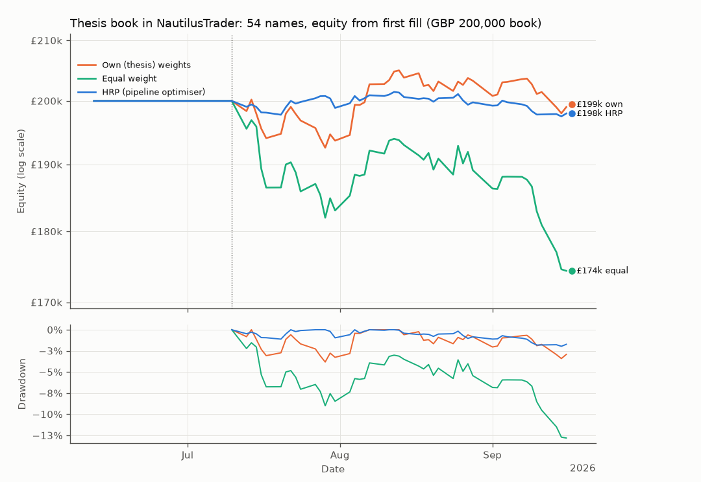
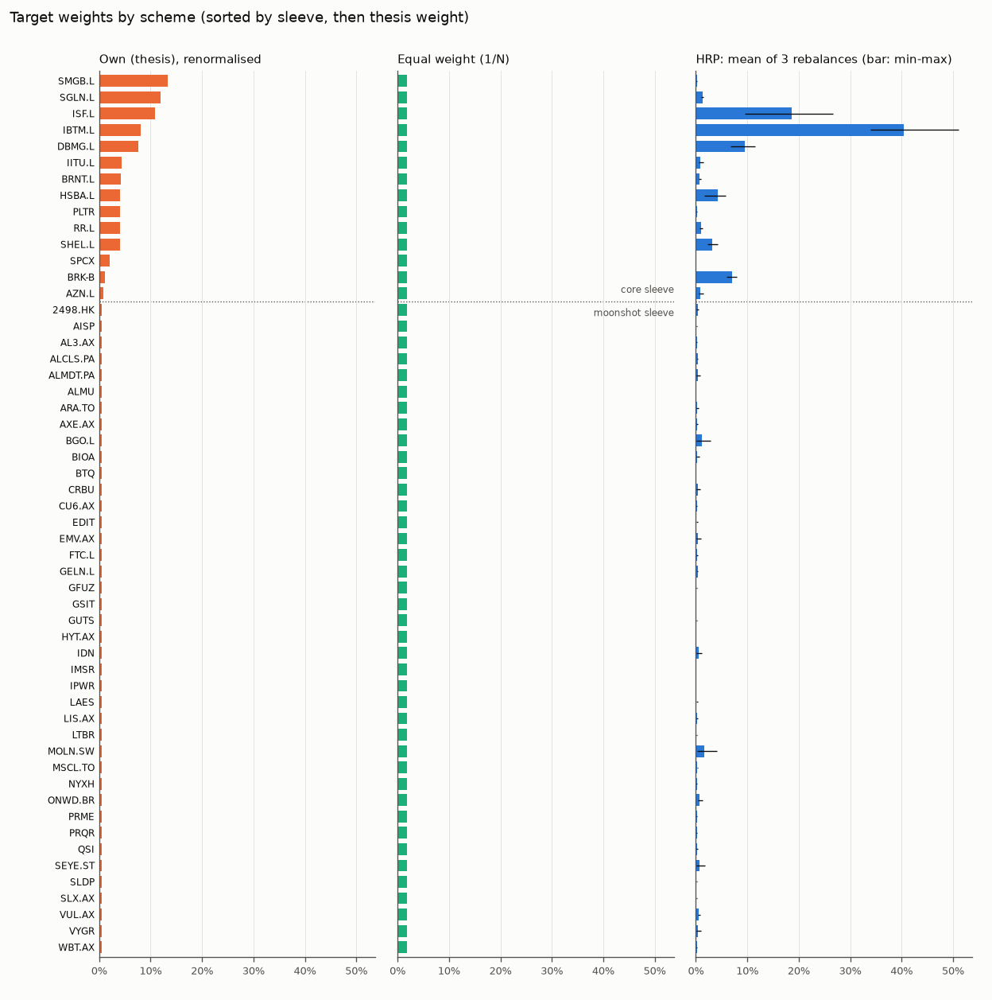

# Thesis portfolio: all 54 names, plumbing and weight check

Generated by `python -m quantstack.thesis.run` (preset `all54`); every number comes from `thesis_summary.json` in this folder.

The only window in which all 54 holdings have prices (SPCX lists on 2026-06-12): 68 rows, a 21-bar warm-up and 3 rebalances. It checks that every name trades and that the fixed weights reproduce the thesis's 80/20 split. It is not performance evidence, and HRP on 20 returns of 54 names is noise by construction.

## Window

- Price window 2026-06-12 to 2026-09-16 (68 trading days; requested 2026-06-12 to 2026-09-16).
- The first 21 bars warm the strategy up; it first trades on 2026-07-10 (0.19 years to the last bar) and rebalances every 21 trading days.
- The engine trades a GBP 100,000,000 book in whole shares, 99% of equity deployed at each rebalance (the thesis holds 0.376% cash). Equity is reported scaled to the GBP 200,000 thesis book (x 0.002); returns and ratios do not depend on the scale.
- Metrics run from the first fill to 2026-09-16.

## Data

- `prices_gbp_daily.csv` (2526 rows x 84 columns) matches `_price_panel_manifest.json` (sha256 `29d68ea26901...`, as of 2026-09-16).
- The levels are a GBP total-return index (dividends reinvested, FX applied), not share prices; only the holding columns are used.
- Each column is rescaled so its minimum over the window is 100 and rounded to 6 decimals; daily returns move by at most 1.0e-08 (before rounding 0.0e+00).

| Repair | Levels before the date divided by | Return that day | Verified | Why |
|---|---|---|---|---|
| MSCL.TO 2026-02-02 | 12.0000 | -91.40% to 3.23% | plausible | 1:12 share consolidation (Satellos, announced 2026-01-28, effective about 2026-01-30) left unadjusted: the panel shows -91.4% on 2026-02-02; after dividing the earlier levels by 12 the day's return is +3.23% |
| MSCL.TO 2021-08-19 | 21.2944 | -95.30% to 0.00% | unverified | suspected unadjusted consolidation: -95.3% on 2021-08-19 (local 5,472 to 257.8 CAD, ratio ~21.3) with no confirmed corporate action; neutralised to a 0% return |

## Universe

- 54 of 54 holdings have usable prices over the whole window (0 excluded, below): core 14, moonshot 40.
- Thesis sleeve split 80.0% / 20.0% (core / moonshot); renormalised over the included names it becomes 80.0% / 20.0% (excluded weight spread pro rata, so the survivors keep their thesis proportions).
- Weight of the excluded names in the thesis: 0.0% of the book.
- Forward-filled levels: 0; gaps of at most 3 bars, never back-filled.

Intended sleeve split per scheme:

| Scheme | Core | Moonshot | Basis |
|---|---|---|---|
| Own (thesis) weights | 80.0% | 20.0% | thesis weights renormalised over included names |
| Equal weight | 25.9% | 74.1% | 1/N name counts |
| HRP (pipeline optimiser) | 88.1% | 11.9% | HRP targets, mean over rebalances |

## Results

|  | Own (thesis) weights | Equal weight | HRP (pipeline optimiser) | Equal weight, pandas buy-and-hold |
|---|---|---|---|---|
| Final equity (GBP, 200,000 book) | 199,009.78 | 174,371.34 | 197,981.39 | 174,581.86 |
| Total return | -0.50% | -12.81% | -1.01% | -12.71% |
| CAGR | -2.63% | -52.12% | -5.30% | -51.81% |
| Annualised volatility | 12.82% | 19.65% | 4.77% | 19.48% |
| Sharpe, rf = 0 (engine) | -0.15 | -3.64 | -1.12 | -3.64 |
| Sharpe, rf = 3.75% (thesis: (CAGR - rf) / vol) | -0.50 | -2.84 | -1.90 | -2.85 |
| Max drawdown | 3.81% | 12.81% | 1.96% | 12.71% |
| Max drawdown peak to trough | 2026-07-14 to 2026-07-29 | 2026-07-10 to 2026-09-16 | 2026-08-12 to 2026-09-15 | 2026-07-10 to 2026-09-16 |
| One-way turnover per year | 297.5% | 337.8% | 507.3% | none (never trades) |
| Fills / denied / rejected | 162 / 0 / 0 | 162 / 0 / 0 | 162 / 0 / 0 | none (never trades) |
| Names held at the end | 54 of 54 | 54 of 54 | 54 of 54 | all |

Every run re-ran the engine's equal-weight benchmark on the same data; its final equity is identical across the 3 runs. The equal-weight scheme *is* that benchmark.

## Thesis comparators

The thesis's own figures for 2021-09-16 to 2026-09-16 (Sharpe with rf = 3.75%, drawdowns as positive losses), from its `analysis_results.json`:

| Series | Convention | CAGR | Volatility | Sharpe (thesis) | Max drawdown | Source |
|---|---|---|---|---|---|---|
| Core (Moderate12) | realised daily, 5y (1261 obs) | 26.07% | 12.06% | 1.67 | 13.38% | `analysis_results.json portfolios.Moderate12.realised_daily_5y` |
| Combined 80/20 book | realised daily, 5y | 23.02% | 13.03% | 1.37 | 16.85% | `analysis_results.json combined_portfolio.realised_daily_5y` |
| VWRP.L (FTSE All-World) | realised daily, 5y | 11.37% | 13.02% | 0.60 | 17.64% | `analysis_results.json asset_stats['VWRP.L']` |

This run trades 2026-07-10 to 2026-09-16, not the thesis window, so these figures are context only. The differences that remain even on the same window:

- the engine rebalances every 21 trading days; the thesis's realised-daily figures hold the weights constant daily (and its monthly backtest rebalances at month-ends);
- names listed after the window starts are excluded here (thesis5y: 19 names, 11% of the book, SPCX and 18 moonshots), so the included book is core-heavier unless own_weights_8020 is used;
- the thesis's moonshot figures are equal-weight over all 40 moonshot names, not only the ones with a full history.

## Largest weights

| Rank | Own (thesis), renormalised | HRP, mean over the engine's rebalances |
|---|---|---|
| 1 | SMGB.L 13.28% | IBTM.L 40.42% |
| 2 | SGLN.L 11.86% | ISF.L 18.55% |
| 3 | ISF.L 10.83% | DBMG.L 9.46% |
| 4 | IBTM.L 8.00% | BRK-B 7.08% |
| 5 | DBMG.L 7.57% | HSBA.L 4.23% |
| 6 | IITU.L 4.32% | SHEL.L 3.21% |
| 7 | BRNT.L 4.14% | MOLN.SW 1.63% |
| 8 | HSBA.L 4.00% | SGLN.L 1.27% |
| 9 | PLTR 4.00% | BGO.L 1.19% |
| 10 | RR.L 4.00% | RR.L 1.03% |

Equal weight holds every included name at 1.852%.

## Target vs achieved weights

Achieved weight = shares x close / equity right after each rebalance's fills; the gap is measured against investment cap x target (the rest is the cash buffer).

**Own (thesis) weights** over 3 rebalances: mean absolute gap 0.000% per name, largest 0.000% (WBT.AX, 2026-07-10); 99.00% of equity invested after rebalancing; 0 name(s) held at under half their target. Per rebalance: `own_weights/execution_weights_fixed_achieved.csv`.

**Equal weight** over 3 rebalances: mean absolute gap 0.000% per name, largest 0.000% (AL3.AX, 2026-09-09); 99.00% of equity invested after rebalancing; 0 name(s) held at under half their target. Per rebalance: `equal_weight/execution_weights_equal_achieved.csv`.

**HRP (pipeline optimiser)** over 3 rebalances: mean absolute gap 0.000% per name, largest 0.000% (WBT.AX, 2026-07-10); 99.00% of equity invested after rebalancing; 0 name(s) held at under half their target. Per rebalance: `hrp_optimised/execution_weights_hrp_achieved.csv`.

The engine trades whole shares at the rescaled levels (the highest here is HYT.AX, up to 384 per share), so a high-priced name with a small weight lands under its target, and one whose target is worth less than a share is not held. At the first rebalance (2026-07-10, 99,000,000 deployable in engine units):

- Own (thesis) weights: no share for none; 1 or 2 shares for none.
- Equal weight: no share for none; 1 or 2 shares for none.

## Allocation stage (in-sample)

Each weight vector fitted (where it is fitted at all) on the whole window's daily returns (2026-06-15 to 2026-09-16, 67 days) and held constant, rebalanced daily, no costs. In-sample by construction: the HRP and Max Sharpe rows saw the returns they are scored on.

| Weight vector | Mean return (arith., ann.) | CAGR | Volatility | Sharpe (rf = 0) | Max drawdown | Effective N | Largest weight |
|---|---|---|---|---|---|---|---|
| Own (thesis), renormalised | -0.58% | -1.51% | 13.88% | -0.04 | 7.09% | 14.9 | 13.3% |
| Own, 80/20 sleeves | -0.58% | -1.51% | 13.88% | -0.04 | 7.09% | 14.9 | 13.3% |
| Equal weight | -46.46% | -38.54% | 21.01% | -2.21 | 16.24% | 54.0 | 1.9% |
| HRP | failed: ValueError: HRP on 54 assets needs at least 108 rows (2x the asset count, so the sample covariance it clusters on is ful |  |  |  |  |  |  |
| Max Sharpe (sample cov) | 46.06% | 58.19% | 5.67% | 8.13 | 1.23% | 8.9 | 20.2% |
| Inverse variance | -2.38% | -2.46% | 4.85% | -0.49 | 2.39% | 5.3 | 36.9% |

## Caveats

- Look-ahead in the own-weights runs: the thesis chose its names and weights on 2026-09-16, with hindsight over this whole window; backtesting them from the window start flatters them. Treat those runs as a description of the chosen book, not as evidence the choice would have worked.
- Survivorship and composition: only names listed before the window starts are held. own_weights spreads the excluded names' weight pro rata, which tilts the book towards core; own_weights_8020 keeps the thesis's sleeve split instead.
- Optimistic market-on-close fills: each rebalance is sized on a day's closes and fills at that same close. No commissions, no stamp duty, no spreads, no FX costs, unlimited liquidity. The thesis notes phone-dealt names (GBP 49 each way) and spreads that dominate costs for the smallest names; none of that is modelled.
- Prices are the thesis build's GBP total-return index (dividends reinvested, FX applied), each column rescaled so its window minimum is 100; returns are unchanged (see Data).
- The engine trades a GBP 100,000,000 book in whole shares with 99% of equity deployed (1.0% cash; the thesis holds 0.376%); curves are scaled to the GBP 200,000 book, so they show none of the thesis's own whole-share rounding.
- Repaired levels: MSCL.TO before 2026-02-02 divided by 12 (plausible); MSCL.TO before 2021-08-19 divided by 21.29 (unverified). Other large one-day moves in the panel are the thesis build's and are not verified here.
- Stale prints (share of days with an unchanged level): GELN.L 67%, BGO.L 54%. Stale prints understate a name's volatility, so HRP overweights it.
- DBMG.L's history before April 2025 is its proxy (DBMF) in the thesis build.
- The allocation-stage statistics are in-sample: HRP and Max Sharpe are fitted on the returns they are scored on. The backtests are not: the engine's HRP only ever sees the trailing lookback window.
- The engine books in USD; per-scheme files label GBP amounts as USD/$, in engine units.

## Dashboard replay

- own_weights: ok, tables {'positions': 54, 'equity': 68, 'fills': 162}
- equal_weight: ok, tables {'positions': 54, 'equity': 68, 'fills': 162}
- hrp_optimised: ok, tables {'positions': 54, 'equity': 68, 'fills': 162}
