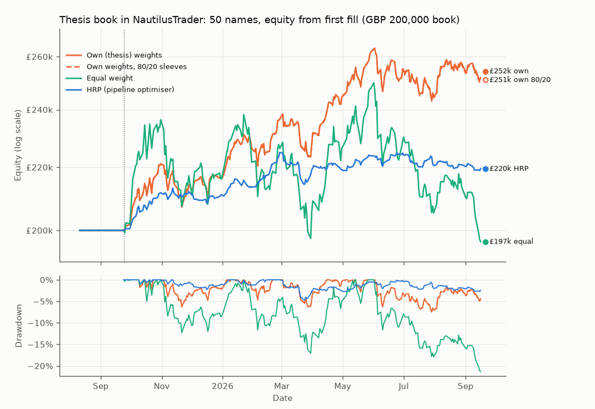
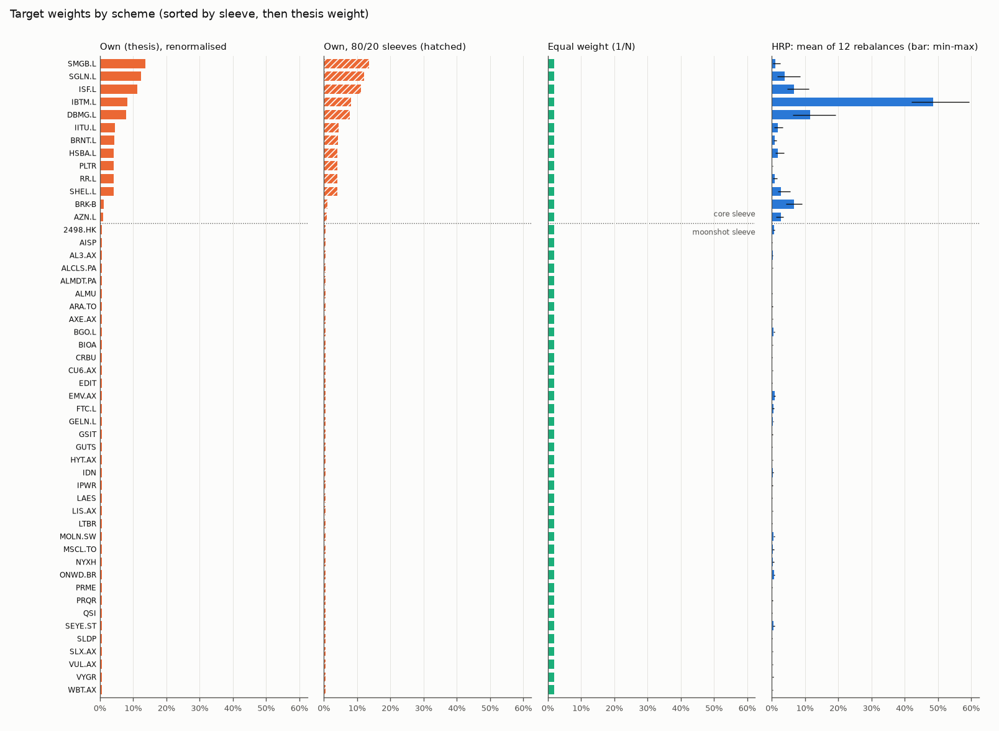

# Thesis portfolio: every name with a year of history (about 1 year of trading)

Generated by `python -m quantstack.thesis.run` (preset `broad1y`); every number comes from `thesis_summary.json` in this folder.

Secondary configuration: every holding with at least 252 bars by 2026-09-16 (BIOA, the latest such listing, sets the start), a full 252-bar warm-up and about one year of trading. Too short for statistical claims.

## Window

- Price window 2024-09-26 to 2026-09-16 (499 trading days; requested 2024-09-26 to 2026-09-16).
- The first 252 bars warm the strategy up; it first trades on 2025-09-24 (0.98 years to the last bar) and rebalances every 21 trading days.
- The engine trades a GBP 100,000,000 book in whole shares, 99% of equity deployed at each rebalance (the thesis holds 0.376% cash). Equity is reported scaled to the GBP 200,000 thesis book (x 0.002); returns and ratios do not depend on the scale.
- Metrics run from the first fill to 2026-09-16.

## Data

- `prices_gbp_daily.csv` (2526 rows x 84 columns) matches `_price_panel_manifest.json` (sha256 `29d68ea26901...`, as of 2026-09-16).
- The levels are a GBP total-return index (dividends reinvested, FX applied), not share prices; only the holding columns are used.
- Each column is rescaled so its minimum over the window is 100 and rounded to 6 decimals; daily returns move by at most 1.0e-08 (before rounding 0.0e+00).

| Repair | Levels before the date divided by | Return that day | Verified | Why |
|---|---|---|---|---|
| MSCL.TO 2026-02-02 | 12.0000 | -91.40% to 3.23% | plausible | 1:12 share consolidation (Satellos, announced 2026-01-28, effective about 2026-01-30) left unadjusted: the panel shows -91.4% on 2026-02-02; after dividing the earlier levels by 12 the day's return is +3.23% |
| MSCL.TO 2021-08-19 | 21.2944 | -95.30% to 0.00% | unverified | suspected unadjusted consolidation: -95.3% on 2021-08-19 (local 5,472 to 257.8 CAD, ratio ~21.3) with no confirmed corporate action; neutralised to a 0% return |

## Universe

- 50 of 54 holdings have usable prices over the whole window (4 excluded, below): core 13, moonshot 37.
- Thesis sleeve split 80.0% / 20.0% (core / moonshot); renormalised over the included names it becomes 80.8% / 19.2% (excluded weight spread pro rata, so the survivors keep their thesis proportions).
- Weight of the excluded names in the thesis: 3.5% of the book.
- Forward-filled levels: 2 (DBMG.L 2); gaps of at most 3 bars, never back-filled.

Intended sleeve split per scheme:

| Scheme | Core | Moonshot | Basis |
|---|---|---|---|
| Own (thesis) weights | 80.8% | 19.2% | thesis weights renormalised over included names |
| Own weights, 80/20 sleeves | 80.0% | 20.0% | thesis split kept, renormalised within sleeves |
| Equal weight | 26.0% | 74.0% | 1/N name counts |
| HRP (pipeline optimiser) | 89.9% | 10.1% | HRP targets, mean over rebalances |

### Excluded

| Ticker | Sleeve | Thesis weight | First level | Reason |
|---|---|---|---|---|
| SPCX | core | 2.000% | 2026-06-12 | first level 2026-06-12 is after the window's first bar 2024-09-26 |
| IMSR | moonshot | 0.500% | 2025-11-03 | first level 2025-11-03 is after the window's first bar 2024-09-26 |
| GFUZ | moonshot | 0.500% | 2025-09-30 | first level 2025-09-30 is after the window's first bar 2024-09-26 |
| BTQ | moonshot | 0.500% | 2025-09-26 | first level 2025-09-26 is after the window's first bar 2024-09-26 |

## Results

|  | Own (thesis) weights | Own weights, 80/20 sleeves | Equal weight | HRP (pipeline optimiser) | Equal weight, pandas buy-and-hold |
|---|---|---|---|---|---|
| Final equity (GBP, 200,000 book) | 251,903.13 | 251,044.80 | 196,615.53 | 219,528.93 | 181,375.71 |
| Total return | 25.95% | 25.52% | -1.69% | 9.76% | -9.31% |
| CAGR | 26.62% | 26.18% | -1.73% | 10.00% | -9.52% |
| Annualised volatility | 14.08% | 14.19% | 24.05% | 5.89% | 25.20% |
| Sharpe, rf = 0 (engine) | 1.74 | 1.71 | 0.05 | 1.64 | -0.27 |
| Sharpe, rf = 3.75% (thesis: (CAGR - rf) / vol) | 1.62 | 1.58 | -0.23 | 1.06 | -0.53 |
| Max drawdown | 7.47% | 7.63% | 21.34% | 4.71% | 24.51% |
| Max drawdown peak to trough | 2026-06-02 to 2026-07-29 | 2026-06-02 to 2026-07-29 | 2026-06-01 to 2026-09-16 | 2026-02-27 to 2026-03-24 | 2026-06-01 to 2026-09-16 |
| One-way turnover per year | 88.0% | 88.6% | 119.8% | 167.3% | none (never trades) |
| Fills / denied / rejected | 600 / 0 / 0 | 600 / 0 / 0 | 599 / 0 / 0 | 599 / 0 / 0 | none (never trades) |
| Names held at the end | 50 of 50 | 50 of 50 | 50 of 50 | 50 of 50 | all |

Every run re-ran the engine's equal-weight benchmark on the same data; its final equity is identical across the 4 runs. The equal-weight scheme *is* that benchmark.

## Thesis comparators

The thesis's own figures for 2021-09-16 to 2026-09-16 (Sharpe with rf = 3.75%, drawdowns as positive losses), from its `analysis_results.json`:

| Series | Convention | CAGR | Volatility | Sharpe (thesis) | Max drawdown | Source |
|---|---|---|---|---|---|---|
| Core (Moderate12) | realised daily, 5y (1261 obs) | 26.07% | 12.06% | 1.67 | 13.38% | `analysis_results.json portfolios.Moderate12.realised_daily_5y` |
| Combined 80/20 book | realised daily, 5y | 23.02% | 13.03% | 1.37 | 16.85% | `analysis_results.json combined_portfolio.realised_daily_5y` |
| VWRP.L (FTSE All-World) | realised daily, 5y | 11.37% | 13.02% | 0.60 | 17.64% | `analysis_results.json asset_stats['VWRP.L']` |

This run trades 2025-09-24 to 2026-09-16, not the thesis window, so these figures are context only. The differences that remain even on the same window:

- the engine rebalances every 21 trading days; the thesis's realised-daily figures hold the weights constant daily (and its monthly backtest rebalances at month-ends);
- names listed after the window starts are excluded here (thesis5y: 19 names, 11% of the book, SPCX and 18 moonshots), so the included book is core-heavier unless own_weights_8020 is used;
- the thesis's moonshot figures are equal-weight over all 40 moonshot names, not only the ones with a full history.

## Largest weights

| Rank | Own (thesis), renormalised | Own, 80/20 sleeves | HRP, mean over the engine's rebalances |
|---|---|---|---|
| 1 | SMGB.L 13.77% | SMGB.L 13.62% | IBTM.L 48.57% |
| 2 | SGLN.L 12.29% | SGLN.L 12.17% | DBMG.L 11.61% |
| 3 | ISF.L 11.22% | ISF.L 11.11% | ISF.L 6.75% |
| 4 | IBTM.L 8.29% | IBTM.L 8.21% | BRK-B 6.67% |
| 5 | DBMG.L 7.85% | DBMG.L 7.77% | SGLN.L 3.96% |
| 6 | IITU.L 4.47% | IITU.L 4.43% | AZN.L 2.76% |
| 7 | BRNT.L 4.29% | BRNT.L 4.24% | SHEL.L 2.71% |
| 8 | HSBA.L 4.15% | HSBA.L 4.10% | HSBA.L 1.92% |
| 9 | PLTR 4.15% | PLTR 4.10% | IITU.L 1.84% |
| 10 | RR.L 4.15% | RR.L 4.10% | SMGB.L 1.04% |

Equal weight holds every included name at 2.000%.

## Target vs achieved weights

Achieved weight = shares x close / equity right after each rebalance's fills; the gap is measured against investment cap x target (the rest is the cash buffer).

**Own (thesis) weights** over 12 rebalances: mean absolute gap 0.000% per name, largest 0.001% (LAES, 2025-12-22); 98.99% of equity invested after rebalancing; 0 name(s) held at under half their target. Per rebalance: `own_weights/execution_weights_fixed_achieved.csv`.

**Own weights, 80/20 sleeves** over 12 rebalances: mean absolute gap 0.000% per name, largest 0.001% (LAES, 2025-09-24); 98.99% of equity invested after rebalancing; 0 name(s) held at under half their target. Per rebalance: `own_weights_8020/execution_weights_fixed_achieved.csv`.

**Equal weight** over 12 rebalances: mean absolute gap 0.000% per name, largest 0.001% (LAES, 2026-02-23); 98.99% of equity invested after rebalancing; 0 name(s) held at under half their target. Per rebalance: `equal_weight/execution_weights_equal_achieved.csv`.

**HRP (pipeline optimiser)** over 12 rebalances: mean absolute gap 0.000% per name, largest 0.001% (LAES, 2026-02-23); 98.99% of equity invested after rebalancing; 0 name(s) held at under half their target. Per rebalance: `hrp_optimised/execution_weights_hrp_achieved.csv`.

The engine trades whole shares at the rescaled levels (the highest here is LAES, up to 2,737 per share), so a high-priced name with a small weight lands under its target, and one whose target is worth less than a share is not held. At the first rebalance (2025-09-24, 99,000,000 deployable in engine units):

- Own (thesis) weights: no share for none; 1 or 2 shares for none.
- Own weights, 80/20 sleeves: no share for none; 1 or 2 shares for none.
- Equal weight: no share for none; 1 or 2 shares for none.

## Allocation stage (in-sample)

Each weight vector fitted (where it is fitted at all) on the whole window's daily returns (2024-09-27 to 2026-09-16, 498 days) and held constant, rebalanced daily, no costs. In-sample by construction: the HRP and Max Sharpe rows saw the returns they are scored on.

| Weight vector | Mean return (arith., ann.) | CAGR | Volatility | Sharpe (rf = 0) | Max drawdown | Effective N | Largest weight |
|---|---|---|---|---|---|---|---|
| Own (thesis), renormalised | 33.48% | 38.42% | 13.71% | 2.44 | 16.69% | 14.0 | 13.8% |
| Own, 80/20 sleeves | 33.54% | 38.49% | 13.81% | 2.43 | 16.85% | 14.2 | 13.6% |
| Equal weight | 37.76% | 41.70% | 24.06% | 1.57 | 28.52% | 50.0 | 2.0% |
| HRP | 9.19% | 9.44% | 5.74% | 1.60 | 6.32% | 3.3 | 53.2% |
| Max Sharpe (sample cov) | 40.13% | 48.49% | 10.65% | 3.77 | 9.09% | 6.9 | 28.4% |
| Inverse variance | 14.03% | 14.80% | 6.71% | 2.09 | 8.62% | 6.0 | 35.0% |

## Caveats

- Look-ahead in the own-weights runs: the thesis chose its names and weights on 2026-09-16, with hindsight over this whole window; backtesting them from the window start flatters them. Treat those runs as a description of the chosen book, not as evidence the choice would have worked.
- Survivorship and composition: only names listed before the window starts are held. own_weights spreads the excluded names' weight pro rata, which tilts the book towards core; own_weights_8020 keeps the thesis's sleeve split instead.
- Optimistic market-on-close fills: each rebalance is sized on a day's closes and fills at that same close. No commissions, no stamp duty, no spreads, no FX costs, unlimited liquidity. The thesis notes phone-dealt names (GBP 49 each way) and spreads that dominate costs for the smallest names; none of that is modelled.
- Prices are the thesis build's GBP total-return index (dividends reinvested, FX applied), each column rescaled so its window minimum is 100; returns are unchanged (see Data).
- The engine trades a GBP 100,000,000 book in whole shares with 99% of equity deployed (1.0% cash; the thesis holds 0.376%); curves are scaled to the GBP 200,000 book, so they show none of the thesis's own whole-share rounding.
- Repaired levels: MSCL.TO before 2026-02-02 divided by 12 (plausible); MSCL.TO before 2021-08-19 divided by 21.29 (unverified). Other large one-day moves in the panel are the thesis build's and are not verified here.
- Stale prints (share of days with an unchanged level): GELN.L 54%, BGO.L 42%. Stale prints understate a name's volatility, so HRP overweights it.
- DBMG.L's history before April 2025 is its proxy (DBMF) in the thesis build.
- The allocation-stage statistics are in-sample: HRP and Max Sharpe are fitted on the returns they are scored on. The backtests are not: the engine's HRP only ever sees the trailing lookback window.
- The engine books in USD; per-scheme files label GBP amounts as USD/$, in engine units.

## Dashboard replay

- own_weights: ok, tables {'positions': 50, 'equity': 499, 'fills': 600}
- own_weights_8020: ok, tables {'positions': 50, 'equity': 499, 'fills': 600}
- equal_weight: ok, tables {'positions': 50, 'equity': 499, 'fills': 599}
- hrp_optimised: ok, tables {'positions': 50, 'equity': 499, 'fills': 599}
