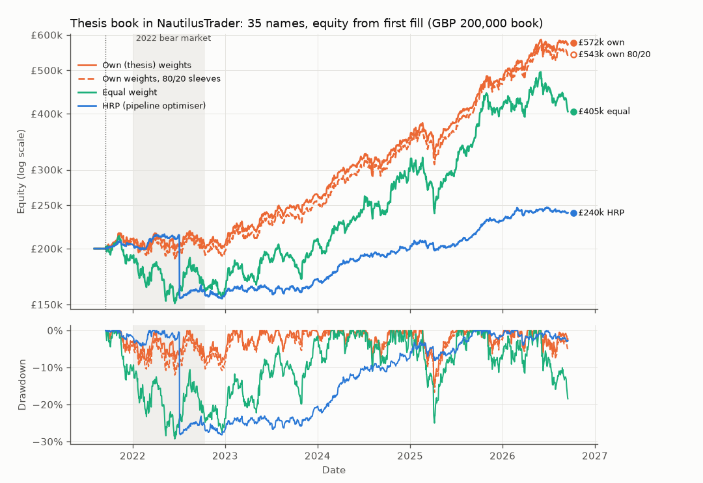
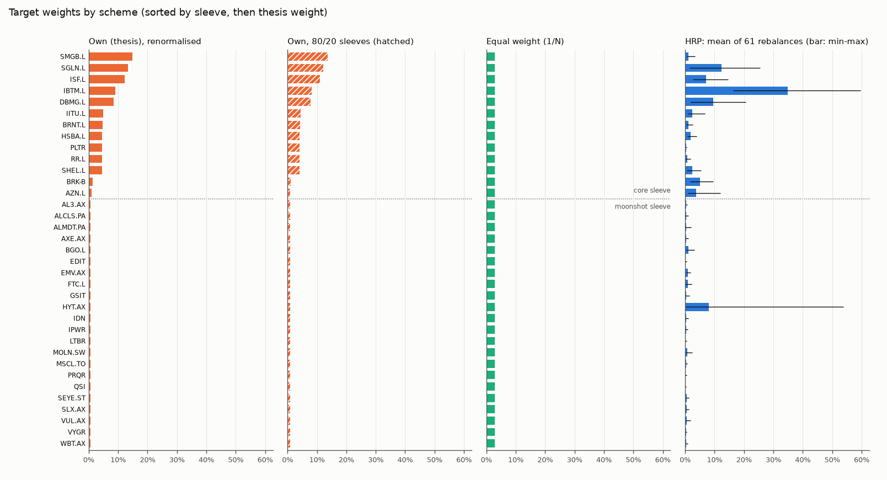

# Thesis portfolio: the thesis's 5-year window (primary)

Generated by `python -m quantstack.thesis.run` (preset `thesis5y`); every number comes from `thesis_summary.json` in this folder.

Primary configuration. The window starts on 2020-12-10, SMGB.L's first level (the largest line, 13.3% of the book); the 193-bar warm-up puts the first fill on 2021-09-16, the thesis's own base date, so the run covers the same 5 years as the thesis's realised-daily figures. Names listed after 2020-12-10 cannot be held for the whole window and are excluded.

## Window

- Price window 2020-12-10 to 2026-09-16 (1454 trading days; requested 2020-12-10 to 2026-09-16).
- The first 193 bars warm the strategy up; it first trades on 2021-09-16 (5.00 years to the last bar) and rebalances every 21 trading days.
- The engine trades a GBP 100,000,000 book in whole shares, 99% of equity deployed at each rebalance (the thesis holds 0.376% cash). Equity is reported scaled to the GBP 200,000 thesis book (x 0.002); returns and ratios do not depend on the scale.
- Metrics run from the first fill to 2026-09-16.

## Data

- `prices_gbp_daily.csv` (2526 rows x 84 columns) matches `_price_panel_manifest.json` (sha256 `29d68ea26901...`, as of 2026-09-16).
- The levels are a GBP total-return index (dividends reinvested, FX applied), not share prices; only the holding columns are used.
- Each column is rescaled so its minimum over the window is 100 and rounded to 6 decimals; daily returns move by at most 2.0e-08 (before rounding 0.0e+00).

| Repair | Levels before the date divided by | Return that day | Verified | Why |
|---|---|---|---|---|
| MSCL.TO 2026-02-02 | 12.0000 | -91.40% to 3.23% | plausible | 1:12 share consolidation (Satellos, announced 2026-01-28, effective about 2026-01-30) left unadjusted: the panel shows -91.4% on 2026-02-02; after dividing the earlier levels by 12 the day's return is +3.23% |
| MSCL.TO 2021-08-19 | 21.2944 | -95.30% to 0.00% | unverified | suspected unadjusted consolidation: -95.3% on 2021-08-19 (local 5,472 to 257.8 CAD, ratio ~21.3) with no confirmed corporate action; neutralised to a 0% return |

## Universe

- 35 of 54 holdings have usable prices over the whole window (19 excluded, below): core 13, moonshot 22.
- Thesis sleeve split 80.0% / 20.0% (core / moonshot); renormalised over the included names it becomes 87.6% / 12.4% (excluded weight spread pro rata, so the survivors keep their thesis proportions).
- Weight of the excluded names in the thesis: 11.0% of the book.
- Forward-filled levels: 2 (DBMG.L 2); gaps of at most 3 bars, never back-filled.

Intended sleeve split per scheme:

| Scheme | Core | Moonshot | Basis |
|---|---|---|---|
| Own (thesis) weights | 87.6% | 12.4% | thesis weights renormalised over included names |
| Own weights, 80/20 sleeves | 80.0% | 20.0% | thesis split kept, renormalised within sleeves |
| Equal weight | 37.1% | 62.9% | 1/N name counts |
| HRP (pipeline optimiser) | 82.9% | 17.1% | HRP targets, mean over rebalances |

### Excluded

| Ticker | Sleeve | Thesis weight | First level | Reason |
|---|---|---|---|---|
| SPCX | core | 2.000% | 2026-06-12 | first level 2026-06-12 is after the window's first bar 2020-12-10 |
| ONWD.BR | moonshot | 0.500% | 2021-10-21 | first level 2021-10-21 is after the window's first bar 2020-12-10 |
| ARA.TO | moonshot | 0.500% | 2021-12-10 | first level 2021-12-10 is after the window's first bar 2020-12-10 |
| NYXH | moonshot | 0.500% | 2021-04-28 | first level 2021-04-28 is after the window's first bar 2020-12-10 |
| ALMU | moonshot | 0.500% | 2023-02-28 | first level 2023-02-28 is after the window's first bar 2020-12-10 |
| GELN.L | moonshot | 0.500% | 2021-11-30 | first level 2021-11-30 is after the window's first bar 2020-12-10 |
| CRBU | moonshot | 0.500% | 2021-07-23 | first level 2021-07-23 is after the window's first bar 2020-12-10 |
| GUTS | moonshot | 0.500% | 2024-02-02 | first level 2024-02-02 is after the window's first bar 2020-12-10 |
| PRME | moonshot | 0.500% | 2022-10-20 | first level 2022-10-20 is after the window's first bar 2020-12-10 |
| CU6.AX | moonshot | 0.500% | 2021-08-25 | first level 2021-08-25 is after the window's first bar 2020-12-10 |
| LAES | moonshot | 0.500% | 2023-05-23 | first level 2023-05-23 is after the window's first bar 2020-12-10 |
| IMSR | moonshot | 0.500% | 2025-11-03 | first level 2025-11-03 is after the window's first bar 2020-12-10 |
| SLDP | moonshot | 0.500% | 2021-05-18 | first level 2021-05-18 is after the window's first bar 2020-12-10 |
| 2498.HK | moonshot | 0.500% | 2024-01-05 | first level 2024-01-05 is after the window's first bar 2020-12-10 |
| GFUZ | moonshot | 0.500% | 2025-09-30 | first level 2025-09-30 is after the window's first bar 2020-12-10 |
| LIS.AX | moonshot | 0.500% | 2021-09-28 | first level 2021-09-28 is after the window's first bar 2020-12-10 |
| BIOA | moonshot | 0.500% | 2024-09-26 | first level 2024-09-26 is after the window's first bar 2020-12-10 |
| AISP | moonshot | 0.500% | 2021-05-10 | first level 2021-05-10 is after the window's first bar 2020-12-10 |
| BTQ | moonshot | 0.500% | 2025-09-26 | first level 2025-09-26 is after the window's first bar 2020-12-10 |

## Results

|  | Own (thesis) weights | Own weights, 80/20 sleeves | Equal weight | HRP (pipeline optimiser) | Equal weight, pandas buy-and-hold |
|---|---|---|---|---|---|
| Final equity (GBP, 200,000 book) | 572,254.08 | 542,700.46 | 404,583.99 | 240,451.52 | 460,173.60 |
| Total return | 186.13% | 171.35% | 102.29% | 20.23% | 130.09% |
| CAGR | 23.40% | 22.10% | 15.13% | 3.75% | 18.14% |
| Annualised volatility | 12.39% | 13.09% | 20.29% | 13.80% | 21.51% |
| Sharpe, rf = 0 (engine) | 1.76 | 1.59 | 0.80 | 0.35 | 0.88 |
| Sharpe, rf = 3.75% (thesis: (CAGR - rf) / vol) | 1.59 | 1.40 | 0.56 | 0.00 | 0.67 |
| Max drawdown | 15.11% | 16.69% | 29.29% | 28.20% | 24.54% |
| Max drawdown peak to trough | 2025-02-19 to 2025-04-07 | 2025-02-19 to 2025-04-07 | 2021-11-08 to 2022-06-16 | 2022-05-06 to 2022-12-19 | 2021-11-08 to 2022-06-17 |
| One-way turnover per year | 43.8% | 49.4% | 80.4% | 115.5% | none (never trades) |
| Fills / denied / rejected | 2132 / 0 / 0 | 2130 / 0 / 0 | 2135 / 0 / 0 | 2134 / 0 / 0 | none (never trades) |
| Names held at the end | 35 of 35 | 35 of 35 | 35 of 35 | 35 of 35 | all |

Every run re-ran the engine's equal-weight benchmark on the same data; its final equity is identical across the 4 runs. The equal-weight scheme *is* that benchmark.

## Thesis comparators

The thesis's own figures for 2021-09-16 to 2026-09-16 (Sharpe with rf = 3.75%, drawdowns as positive losses), from its `analysis_results.json`:

| Series | Convention | CAGR | Volatility | Sharpe (thesis) | Max drawdown | Source |
|---|---|---|---|---|---|---|
| Core (Moderate12) | realised daily, 5y (1261 obs) | 26.07% | 12.06% | 1.67 | 13.38% | `analysis_results.json portfolios.Moderate12.realised_daily_5y` |
| Combined 80/20 book | realised daily, 5y | 23.02% | 13.03% | 1.37 | 16.85% | `analysis_results.json combined_portfolio.realised_daily_5y` |
| VWRP.L (FTSE All-World) | realised daily, 5y | 11.37% | 13.02% | 0.60 | 17.64% | `analysis_results.json asset_stats['VWRP.L']` |

This run trades the same window, so the comparison is like for like apart from:

- the engine rebalances every 21 trading days; the thesis's realised-daily figures hold the weights constant daily (and its monthly backtest rebalances at month-ends);
- names listed after the window starts are excluded here (thesis5y: 19 names, 11% of the book, SPCX and 18 moonshots), so the included book is core-heavier unless own_weights_8020 is used;
- the thesis's moonshot figures are equal-weight over all 40 moonshot names, not only the ones with a full history.

## Largest weights

| Rank | Own (thesis), renormalised | Own, 80/20 sleeves | HRP, mean over the engine's rebalances |
|---|---|---|---|
| 1 | SMGB.L 14.93% | SMGB.L 13.62% | IBTM.L 34.95% |
| 2 | SGLN.L 13.33% | SGLN.L 12.17% | SGLN.L 12.41% |
| 3 | ISF.L 12.17% | ISF.L 11.11% | DBMG.L 9.51% |
| 4 | IBTM.L 8.99% | IBTM.L 8.21% | HYT.AX 8.04% |
| 5 | DBMG.L 8.51% | DBMG.L 7.77% | ISF.L 7.12% |
| 6 | IITU.L 4.85% | IITU.L 4.43% | BRK-B 5.05% |
| 7 | BRNT.L 4.65% | BRNT.L 4.24% | AZN.L 3.79% |
| 8 | HSBA.L 4.49% | HSBA.L 4.10% | SHEL.L 2.46% |
| 9 | PLTR 4.49% | PLTR 4.10% | IITU.L 2.34% |
| 10 | RR.L 4.49% | RR.L 4.10% | HSBA.L 1.88% |

Equal weight holds every included name at 2.857%.

## Target vs achieved weights

Achieved weight = shares x close / equity right after each rebalance's fills; the gap is measured against investment cap x target (the rest is the cash buffer).

**Own (thesis) weights** over 61 rebalances: mean absolute gap 0.000% per name, largest 0.006% (HYT.AX, 2022-05-18); 99.00% of equity invested after rebalancing; 0 name(s) held at under half their target. Per rebalance: `own_weights/execution_weights_fixed_achieved.csv`.

**Own weights, 80/20 sleeves** over 61 rebalances: mean absolute gap 0.000% per name, largest 0.004% (HYT.AX, 2021-10-15); 99.00% of equity invested after rebalancing; 0 name(s) held at under half their target. Per rebalance: `own_weights_8020/execution_weights_fixed_achieved.csv`.

**Equal weight** over 61 rebalances: mean absolute gap 0.000% per name, largest 0.006% (HYT.AX, 2021-12-14); 98.99% of equity invested after rebalancing; 0 name(s) held at under half their target. Per rebalance: `equal_weight/execution_weights_equal_achieved.csv`.

**HRP (pipeline optimiser)** over 61 rebalances: mean absolute gap 0.000% per name, largest 0.004% (HYT.AX, 2021-10-15); 98.99% of equity invested after rebalancing; 0 name(s) held at under half their target. Per rebalance: `hrp_optimised/execution_weights_hrp_achieved.csv`.

The engine trades whole shares at the rescaled levels (the highest here is EDIT, up to 8,674 per share), so a high-priced name with a small weight lands under its target, and one whose target is worth less than a share is not held. At the first rebalance (2021-09-16, 99,000,000 deployable in engine units):

- Own (thesis) weights: no share for none; 1 or 2 shares for none.
- Own weights, 80/20 sleeves: no share for none; 1 or 2 shares for none.
- Equal weight: no share for none; 1 or 2 shares for none.

## Allocation stage (in-sample)

Each weight vector fitted (where it is fitted at all) on the whole window's daily returns (2020-12-11 to 2026-09-16, 1453 days) and held constant, rebalanced daily, no costs. In-sample by construction: the HRP and Max Sharpe rows saw the returns they are scored on.

| Weight vector | Mean return (arith., ann.) | CAGR | Volatility | Sharpe (rf = 0) | Max drawdown | Effective N | Largest weight |
|---|---|---|---|---|---|---|---|
| Own (thesis), renormalised | 22.33% | 24.06% | 12.35% | 1.81 | 15.19% | 11.9 | 14.9% |
| Own, 80/20 sleeves | 22.35% | 23.98% | 13.01% | 1.72 | 16.53% | 14.1 | 13.6% |
| Equal weight | 23.21% | 23.62% | 19.97% | 1.16 | 28.31% | 35.0 | 2.9% |
| HRP | 9.27% | 9.49% | 6.36% | 1.46 | 7.74% | 5.0 | 39.3% |
| Max Sharpe (sample cov) | 27.40% | 30.75% | 10.76% | 2.55 | 10.52% | 8.2 | 22.1% |
| Inverse variance | 12.67% | 13.21% | 7.25% | 1.75 | 8.54% | 7.6 | 27.9% |

## Caveats

- Look-ahead in the own-weights runs: the thesis chose its names and weights on 2026-09-16, with hindsight over this whole window; backtesting them from the window start flatters them. Treat those runs as a description of the chosen book, not as evidence the choice would have worked.
- Survivorship and composition: only names listed before the window starts are held. own_weights spreads the excluded names' weight pro rata, which tilts the book towards core; own_weights_8020 keeps the thesis's sleeve split instead.
- Optimistic market-on-close fills: each rebalance is sized on a day's closes and fills at that same close. No commissions, no stamp duty, no spreads, no FX costs, unlimited liquidity. The thesis notes phone-dealt names (GBP 49 each way) and spreads that dominate costs for the smallest names; none of that is modelled.
- Prices are the thesis build's GBP total-return index (dividends reinvested, FX applied), each column rescaled so its window minimum is 100; returns are unchanged (see Data).
- The engine trades a GBP 100,000,000 book in whole shares with 99% of equity deployed (1.0% cash; the thesis holds 0.376%); curves are scaled to the GBP 200,000 book, so they show none of the thesis's own whole-share rounding.
- Repaired levels: MSCL.TO before 2026-02-02 divided by 12 (plausible); MSCL.TO before 2021-08-19 divided by 21.29 (unverified). Other large one-day moves in the panel are the thesis build's and are not verified here.
- Stale prints (share of days with an unchanged level): FTC.L 34%, BGO.L 29%. Stale prints understate a name's volatility, so HRP overweights it.
- DBMG.L's history before April 2025 is its proxy (DBMF) in the thesis build.
- The allocation-stage statistics are in-sample: HRP and Max Sharpe are fitted on the returns they are scored on. The backtests are not: the engine's HRP only ever sees the trailing lookback window.
- The engine books in USD; per-scheme files label GBP amounts as USD/$, in engine units.

## Dashboard replay

- own_weights: ok, tables {'positions': 35, 'equity': 1454, 'fills': 2132}
- own_weights_8020: ok, tables {'positions': 35, 'equity': 1454, 'fills': 2130}
- equal_weight: ok, tables {'positions': 35, 'equity': 1454, 'fills': 2135}
- hrp_optimised: ok, tables {'positions': 35, 'equity': 1454, 'fills': 2134}
